<!-- README.md is generated from README.Rmd. Please edit that file -->

# bean 🫛

<!-- badges: start -->

[](https://github.com/paanwaris/bean/actions/workflows/R-CMD-check.yaml)
<!-- badges: end -->

## Ecological Motivation

The `bean` package provides a tool to address a fundamental challenge in
species distribution modeling (SDM) and ecological niche modeling (ENM):
**sampling bias**. Occurrence records for species are rarely collected
through a systematic, random process. Instead, they often cluster in
easily accessible areas (like roads and cities) or in well-studied
research sites. This spatial bias can translate into an **environmental
bias**, where the model incorrectly learns that the species is
associated with the environmental conditions of those heavily sampled
areas, rather than its true ecological requirements.

`bean` tackles this problem by thinning occurrence data in
**environmental space**. The goal is to create a more uniform
distribution of points across the species’ observed environmental niche,
reducing the influence of densely clustered records. This allows for the
construction of a more accurate **fundamental niche** volume, which can
then be projected into geographic space to create a less biased
prediction of habitat suitability.

The name `bean` reflects the core principle of the method: ensuring that
each “pod” (a grid cell in environmental space) contains only a
specified number of “beans” (occurrence points).

## Installation

To use the package, you first need to install it from GitHub. The
following code will check for the required `devtools` package, install
it if necessary, and then install `bean`.

``` r
# 1. Install devtools if you don't have it yet
if (!require("devtools")) {
  install.packages("devtools")
}

# 2. Install bean from GitHub
devtools::install_github("paanwaris/bean")
```

## The `bean` Protocol: A Step-by-Step Guide

The recommended workflow is a four-step process designed to be
transparent and reproducible.

### Step 1: Data Preparation and Visualization

First, load and inspect your data. You’ll need cleaned occurrence
records and associated environmental variables. It’s essential to remove
missing values, as they will interfere with analysis.

``` r
# Load required libraries
library(bean)
library(dplyr)
#> 
#> Attaching package: 'dplyr'
#> The following objects are masked from 'package:stats':
#> 
#>     filter, lag
#> The following objects are masked from 'package:base':
#> 
#>     intersect, setdiff, setequal, union
library(ggplot2)
library(raster)
#> Loading required package: sp
#> 
#> Attaching package: 'raster'
#> The following object is masked from 'package:dplyr':
#> 
#>     select
library(dismo)
library(rJava)

# Load the raw occurrence data
# This path might need to be adjusted based on your project structure.
occ_file <- system.file("extdata", "P_maniculatus_samples.csv", package = "bean")
occ_data_raw <- read.csv(occ_file)

# --- Critical: Clean the data ---
# Remove rows with NA or other non-finite values in the environmental variables.
# The functions in 'bean' have internal checks, but it's best practice to do this explicitly.
occ_data <- occ_data_raw %>%
  filter(is.finite(BIO1) & is.finite(BIO12))

head(occ_data)
#>   X       BIO1       BIO2        BIO3       BIO4       BIO5       BIO6
#> 1 1 -1.4532242  0.2093895 -1.25028926  1.4868788 -1.2801579 -1.5555510
#> 2 2 -0.8089705 -0.1140447 -0.38563031  0.4086082 -1.4298291 -0.8036575
#> 3 3 -0.7874954 -0.1140447 -0.38563031  0.3989951 -1.4048839 -0.7805223
#> 4 4 -1.8397765  0.5004803  0.04669916  0.1666783 -1.7541167 -1.1159825
#> 5 5 -1.3028984 -0.2757618 -1.25028926  1.1990196 -1.3300483 -1.1159825
#> 6 6 -0.3150427 -0.9873171 -0.38563031 -0.8934342 -0.1077337  0.5497509
#>         BIO7      BIO10      BIO11       BIO12      BIO13      BIO14      BIO15
#> 1  1.0605147 -1.3376190 -1.6452726 -0.35902605 -0.1057818 -1.0525058  0.7984393
#> 2  0.1550299 -1.0101018 -0.7985610  0.08377747  0.3391621 -0.5027304  0.7224502
#> 3  0.1422766 -0.9828087 -0.7698589  0.09254586  0.3454289 -0.4909072  0.7203555
#> 4  0.3335762 -2.1837049 -1.2290923 -1.18763858 -1.2087413 -0.6859888 -0.9703739
#> 5  0.5503824 -1.3103259 -1.4587090 -0.30641573  0.0947563 -1.0111248  1.0056930
#> 6 -0.6611818 -0.8736363  0.1629590 -0.41602056 -0.8327324  0.1889226 -1.4147882
#>         BIO16      BIO17          x        y
#> 1 -0.08591658 -1.1162098  -90.10842 45.79468
#> 2  0.30954512 -0.2943088  -72.23842 42.46228
#> 3  0.31592354 -0.2832766  -72.23842 42.42062
#> 4 -1.17981468 -0.8348880 -105.47911 40.21291
#> 5  0.08630061 -1.0996615  -89.56690 46.25288
#> 6 -0.84175871  0.2131737 -122.01615 45.83633

# Visualize the initial distribution in environmental space
ggplot(occ_data, aes(x = BIO1, y = BIO12)) +
  geom_point(alpha = 0.5, color = "darkred") +
  labs(
    title = "Original Occurrence Points in Environmental Space",
    subtitle = paste(nrow(occ_data), "total points (after cleaning)"),
    x = "Mean Annual Temperature (BIO1)",
    y = "Annual Precipitation (BIO12)",
    caption = "Data for Peromyscus maniculatus"
  ) +
  theme_bw()
```

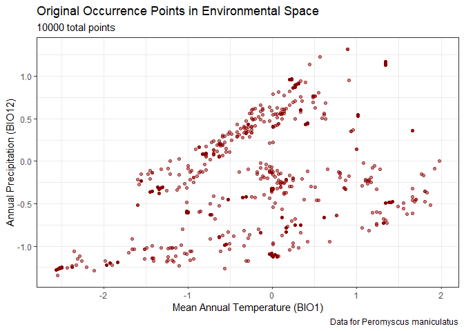

### Step 2: Objective Grid Resolution using Pairwise Distances

The most critical parameter in environmental gridding is the
`grid_resolution`. Instead of guessing this value, we can derive it
objectively from the data by analyzing the **distribution of pairwise
environmental distances**.

The logic is to calculate the Euclidean distance between all pairs of
points in the (scaled) environmental space. A small quantile of this
distribution (e.g., the 10th percentile) represents a typical distance
between “close” points. Using this value as the grid resolution is
statistically justified because it adapts the cell size to the inherent
scale of clustering within the dataset.

The `find_env_resolution()` function automates this process.

``` r
# Set a seed for reproducibility of the resampling in the correlogram
set.seed(81)  

# Let's use the 10th percentile of distances as our resolution
resolution_results <- find_env_resolution(
  data = occ_data,
  env_vars = c("BIO1", "BIO12"),
  quantile = 0.1
)
#> Calculating pairwise distances for each environmental axis...
#> Resolution at 0.10 quantile:
#>  - BIO1: 0.107376
#>  - BIO12: 0.039458

# The function returns a suggested resolution and the full distance distribution
resolution_results
#> --- Bean Environmental Resolution Analysis (Per-Axis Distance) ---
#> 
#> Suggested Grid Resolutions:
#>   - BIO1: 0.107376
#>   - BIO12: 0.039458
#> 
#> To see the full distance distributions, run plot(your_results_object).

# We can also plot the distribution to visualize the analysis
# The blue line shows the distance at the chosen quantile.
plot(resolution_results)
```

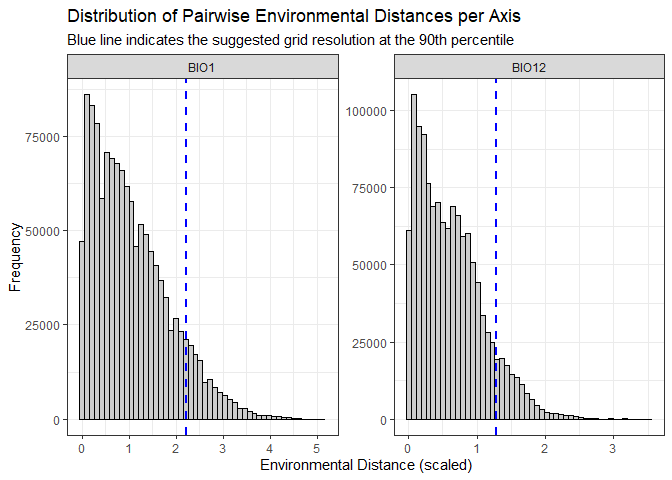

``` r

# Let's use this objective resolution in the next step
grid_res <- resolution_results$suggested_resolution
```

### Step 3: Parameter Exploration with `find_optimal_cap()`

This is the most important step for ensuring a defensible thinning
strategy. Instead of guessing parameters, `find_optimal_cap()` allows
you to explore the trade-offs and make a data-driven choice.

**Key Parameters:** \* `grid_resolution`: This defines the size of the
cells in your environmental grid. The choice is ecologically
significant. A small value creates a fine grid, which is sensitive to
small environmental variations but may not thin large, dense clusters
effectively. A large value creates a coarse grid, which is better for
thinning broad-scale bias but may group distinct environmental
conditions together. \* `target_percent`: This is your goal for data
retention. A value of `0.5` means you want to keep approximately 50% of
your data.

The function returns two key recommendations to guide your choice: 1.
`best_cap_closest`: The cap that results in a point count *numerically
closest* to your target. 2. `best_cap_above_target`: The cap that
results in a point count that is *closest to, but not below*, your
target. This is often the safer, more conservative choice if you want to
avoid losing too much data.

``` r
# You can manually define the grid resolution based on ecological knowledge
# grid_res <- 0.1 # A resolution of 0.1 unit for the environmental axies

# Let's target retaining 80% of the data
optimal_params <- find_optimal_cap(
  data = occ_data,
  env_vars = c("BIO1", "BIO12"),
  grid_resolution = grid_res,
  target_percent = 0.80
)
#> Searching for optimal cap...
#>   |                                                                              |                                                                      |   0%  |                                                                              |                                                                      |   1%  |                                                                              |=                                                                     |   1%  |                                                                              |=                                                                     |   2%  |                                                                              |==                                                                    |   2%  |                                                                              |==                                                                    |   3%  |                                                                              |==                                                                    |   4%  |                                                                              |===                                                                   |   4%  |                                                                              |===                                                                   |   5%  |                                                                              |====                                                                  |   5%  |                                                                              |====                                                                  |   6%  |                                                                              |=====                                                                 |   6%  |                                                                              |=====                                                                 |   7%  |                                                                              |=====                                                                 |   8%  |                                                                              |======                                                                |   8%  |                                                                              |======                                                                |   9%  |                                                                              |=======                                                               |   9%  |                                                                              |=======                                                               |  10%  |                                                                              |=======                                                               |  11%  |                                                                              |========                                                              |  11%  |                                                                              |========                                                              |  12%  |                                                                              |=========                                                             |  12%  |                                                                              |=========                                                             |  13%  |                                                                              |=========                                                             |  14%  |                                                                              |==========                                                            |  14%  |                                                                              |==========                                                            |  15%  |                                                                              |===========                                                           |  15%  |                                                                              |===========                                                           |  16%  |                                                                              |============                                                          |  16%  |                                                                              |============                                                          |  17%  |                                                                              |============                                                          |  18%  |                                                                              |=============                                                         |  18%  |                                                                              |=============                                                         |  19%  |                                                                              |==============                                                        |  19%  |                                                                              |==============                                                        |  20%  |                                                                              |==============                                                        |  21%  |                                                                              |===============                                                       |  21%  |                                                                              |===============                                                       |  22%  |                                                                              |================                                                      |  22%  |                                                                              |================                                                      |  23%  |                                                                              |================                                                      |  24%  |                                                                              |=================                                                     |  24%  |                                                                              |=================                                                     |  25%  |                                                                              |==================                                                    |  25%  |                                                                              |==================                                                    |  26%  |                                                                              |===================                                                   |  26%  |                                                                              |===================                                                   |  27%  |                                                                              |===================                                                   |  28%  |                                                                              |====================                                                  |  28%  |                                                                              |====================                                                  |  29%  |                                                                              |=====================                                                 |  29%  |                                                                              |=====================                                                 |  30%  |                                                                              |=====================                                                 |  31%  |                                                                              |======================                                                |  31%  |                                                                              |======================                                                |  32%  |                                                                              |=======================                                               |  32%  |                                                                              |=======================                                               |  33%  |                                                                              |=======================                                               |  34%  |                                                                              |========================                                              |  34%  |                                                                              |========================                                              |  35%  |                                                                              |=========================                                             |  35%  |                                                                              |=========================                                             |  36%  |                                                                              |==========================                                            |  36%  |                                                                              |==========================                                            |  37%  |                                                                              |==========================                                            |  38%  |                                                                              |===========================                                           |  38%  |                                                                              |===========================                                           |  39%  |                                                                              |============================                                          |  39%  |                                                                              |============================                                          |  40%  |                                                                              |============================                                          |  41%  |                                                                              |=============================                                         |  41%  |                                                                              |=============================                                         |  42%  |                                                                              |==============================                                        |  42%  |                                                                              |==============================                                        |  43%  |                                                                              |==============================                                        |  44%  |                                                                              |===============================                                       |  44%  |                                                                              |===============================                                       |  45%  |                                                                              |================================                                      |  45%  |                                                                              |================================                                      |  46%  |                                                                              |=================================                                     |  47%  |                                                                              |=================================                                     |  48%  |                                                                              |==================================                                    |  48%  |                                                                              |==================================                                    |  49%  |                                                                              |===================================                                   |  49%  |                                                                              |===================================                                   |  50%  |                                                                              |===================================                                   |  51%  |                                                                              |====================================                                  |  51%  |                                                                              |====================================                                  |  52%  |                                                                              |=====================================                                 |  52%  |                                                                              |=====================================                                 |  53%  |                                                                              |======================================                                |  54%  |                                                                              |======================================                                |  55%  |                                                                              |=======================================                               |  55%  |                                                                              |=======================================                               |  56%  |                                                                              |========================================                              |  56%  |                                                                              |========================================                              |  57%  |                                                                              |========================================                              |  58%  |                                                                              |=========================================                             |  58%  |                                                                              |=========================================                             |  59%  |                                                                              |==========================================                            |  59%  |                                                                              |==========================================                            |  60%  |                                                                              |==========================================                            |  61%  |                                                                              |===========================================                           |  61%  |                                                                              |===========================================                           |  62%  |                                                                              |============================================                          |  62%  |                                                                              |============================================                          |  63%  |                                                                              |============================================                          |  64%  |                                                                              |=============================================                         |  64%  |                                                                              |=============================================                         |  65%  |                                                                              |==============================================                        |  65%  |                                                                              |==============================================                        |  66%  |                                                                              |===============================================                       |  66%  |                                                                              |===============================================                       |  67%  |                                                                              |===============================================                       |  68%  |                                                                              |================================================                      |  68%  |                                                                              |================================================                      |  69%  |                                                                              |=================================================                     |  69%  |                                                                              |=================================================                     |  70%  |                                                                              |=================================================                     |  71%  |                                                                              |==================================================                    |  71%  |                                                                              |==================================================                    |  72%  |                                                                              |===================================================                   |  72%  |                                                                              |===================================================                   |  73%  |                                                                              |===================================================                   |  74%  |                                                                              |====================================================                  |  74%  |                                                                              |====================================================                  |  75%  |                                                                              |=====================================================                 |  75%  |                                                                              |=====================================================                 |  76%  |                                                                              |======================================================                |  76%  |                                                                              |======================================================                |  77%  |                                                                              |======================================================                |  78%  |                                                                              |=======================================================               |  78%  |                                                                              |=======================================================               |  79%  |                                                                              |========================================================              |  79%  |                                                                              |========================================================              |  80%  |                                                                              |========================================================              |  81%  |                                                                              |=========================================================             |  81%  |                                                                              |=========================================================             |  82%  |                                                                              |==========================================================            |  82%  |                                                                              |==========================================================            |  83%  |                                                                              |==========================================================            |  84%  |                                                                              |===========================================================           |  84%  |                                                                              |===========================================================           |  85%  |                                                                              |============================================================          |  85%  |                                                                              |============================================================          |  86%  |                                                                              |=============================================================         |  86%  |                                                                              |=============================================================         |  87%  |                                                                              |=============================================================         |  88%  |                                                                              |==============================================================        |  88%  |                                                                              |==============================================================        |  89%  |                                                                              |===============================================================       |  89%  |                                                                              |===============================================================       |  90%  |                                                                              |===============================================================       |  91%  |                                                                              |================================================================      |  91%  |                                                                              |================================================================      |  92%  |                                                                              |=================================================================     |  92%  |                                                                              |=================================================================     |  93%  |                                                                              |=================================================================     |  94%  |                                                                              |==================================================================    |  94%  |                                                                              |==================================================================    |  95%  |                                                                              |===================================================================   |  95%  |                                                                              |===================================================================   |  96%  |                                                                              |====================================================================  |  96%  |                                                                              |====================================================================  |  97%  |                                                                              |====================================================================  |  98%  |                                                                              |===================================================================== |  98%  |                                                                              |===================================================================== |  99%  |                                                                              |======================================================================|  99%  |                                                                              |======================================================================| 100%

# The function automatically saves results to the output directory.
# We can also inspect the returned list object.
# Print the recommendations
optimal_params
#> --- Bean Optimization Results ---
#> 
#> Recommendation for 'Closest to Target':
#>   - Best Cap: 454
#>   - Retained Points: 8000
#> 
#> Recommendation for 'Closest Above Target':
#>   - Best Cap: 454
#>   - Retained Points: 8000

# Visualize the search process to understand the trade-offs
# The plot is also saved as a PNG in the output directory.
plot(optimal_params)
```

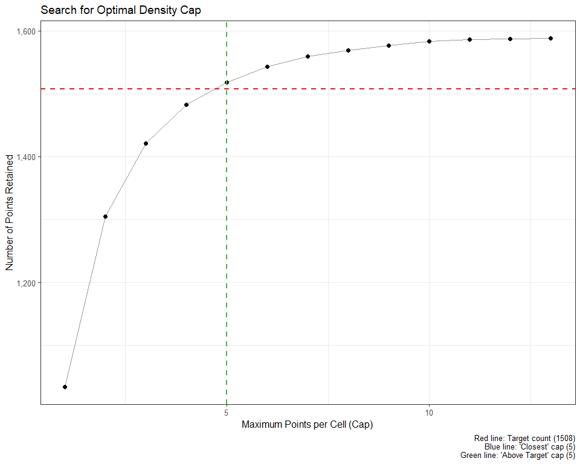

``` r
#The plot and the output list show that to get closest to our target of 80%.
```

### Step 4: Apply Thinning

#### Method A: Stochastic Thinning with `thin_env_density`

Based on the exploration in Step 2, you can now make an informed
decision and apply the final thinning. For this protocol, we will
proceed with the `best_cap_above_target` to ensure we meet our minimum
data requirement.

``` r
# --- Choose a cap and apply thinning ---
# This logic ensures that even if one recommendation is NA, the code will not fail.

# Default to a safe value
chosen_cap <- optimal_params$best_cap_above_target
# Proceeding with cap 
chosen_cap
#> [1] 454

thinned_data <- thin_env_density(
  data = occ_data,
  env_vars = c("BIO1", "BIO12"),
  grid_resolution = grid_res, 
  max_per_cell = chosen_cap
)

thinned_data
#> --- Bean Stochastic Thinning Results ---
#> 
#> Thinned 10000 original points to 8000 points.
#> This represents a retention of 80.0% of the data.
```

### Visualize the Thinning Process with Grids

To see exactly what the function is doing, we can draw the environmental
grid over our plots.

``` r
# --- Calculate Grid Line Positions ---
# The grid lines correspond to the 'grid_resolution' parameter.

# For the x-axis (BIO1)
x_range <- range(occ_data$BIO1, na.rm = TRUE)
x_breaks <- seq(
  from = floor(x_range[1] / grid_res[1]) * grid_res[1],
  to = ceiling(x_range[2] / grid_res[1]) * grid_res[1],
  by = grid_res[1]
)

# For the y-axis (BIO12)
y_range <- range(occ_data$BIO12, na.rm = TRUE)
y_breaks <- seq(
  from = floor(y_range[1] / grid_res[2]) * grid_res[2],
  to = ceiling(y_range[2] / grid_res[2]) * grid_res[2],
  by = grid_res[2]
)
```

Now, let’s create the plots with the grid overlay.

#### Original Data with Grid

This plot shows the initial clustering of points within the
environmental grid cells.

``` r
ggplot(occ_data, aes(x = BIO1, y = BIO12)) +
  geom_vline(xintercept = x_breaks, color = "grey70", linetype = "dashed", linewidth = 0.5) +
  geom_hline(yintercept = y_breaks, color = "grey70", linetype = "dashed", linewidth = 0.5) +
  geom_point(color = "#D55E00", alpha = 0.6, size = 1.5) +
  labs(
    title = "Original Points with Environmental Grid",
    subtitle = paste(nrow(occ_data), "total points"),
    x = "Mean Annual Temperature (BIO1)",
    y = "Annual Precipitation (BIO12)"
  ) +
  theme_bw() +
  theme(panel.grid.major = element_blank(),
    panel.grid.minor = element_blank(),
    panel.background = element_blank())
```

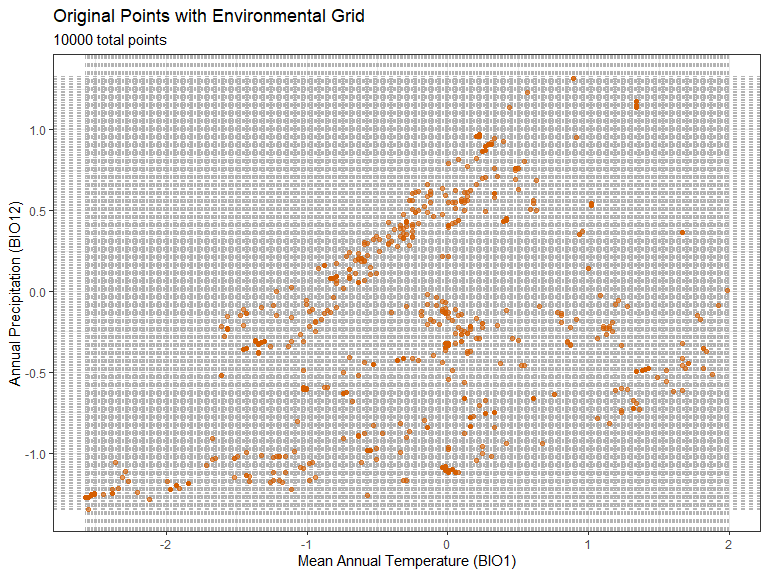

#### Thinned Data with Grid

This plot shows the result: a maximum of 454 point(s) per cell.

``` r
ggplot(thinned_data$thinned_data, aes(x = BIO1, y = BIO12)) +
  geom_vline(xintercept = x_breaks, color = "grey70", linetype = "dashed", linewidth = 0.5) +
  geom_hline(yintercept = y_breaks, color = "grey70", linetype = "dashed", linewidth = 0.5) +
  geom_point(color = "#0072B2", alpha = 0.6, size = 1.5) +
  labs(
    title = "Thinned Occurrence Points on Environmental Grid",
    subtitle = paste(nrow(thinned_data), "points remaining (max", chosen_cap, "per cell)"),
    x = "Mean Annual Temperature (BIO1)",
    y = "Annual Precipitation (BIO12)"
  ) +
  theme_bw() +
  theme(panel.grid.major = element_blank(),
    panel.grid.minor = element_blank(),
    panel.background = element_blank())
```

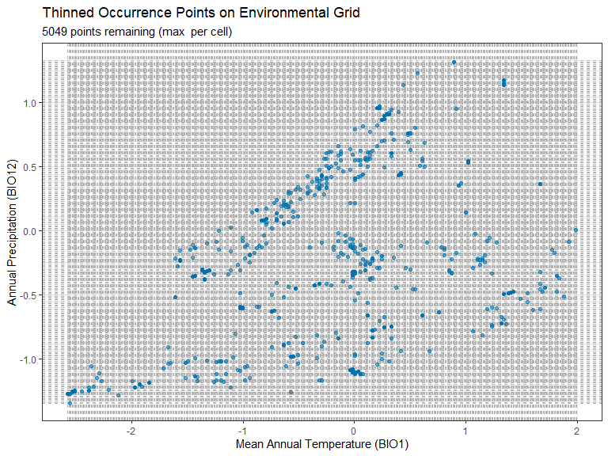

#### Combined Comparison with Grid

``` r
ggplot() +
  # 1. Plot the original data as a background layer
  geom_point(data = occ_data, aes(x = BIO1, y = BIO12), 
             color = "#D55E00", alpha = 0.6, size = 2) +
  
  # 2. Add the grid lines
  geom_vline(xintercept = x_breaks, color = "grey70", linetype = "dashed", linewidth = 0.5) +
  geom_hline(yintercept = y_breaks, color = "grey70", linetype = "dashed", linewidth = 0.5) +
  
  # 3. Plot the thinned data on top in a prominent color
  geom_point(data = thinned_data$thinned_data, aes(x = BIO1, y = BIO12), 
             color = "#0072B2", alpha = 0.7, size = 1) +
  
  # 4. Add informative labels
  labs(
    title = "Thinned Points Overlaid on Original Data",
    subtitle = paste(nrow(thinned_data$thinned_data), "points remaining (blue) from", nrow(occ_data), "original points (orange)"),
    x = "Mean Annual Temperature (BIO1)",
    y = "Annual Precipitation (BIO12)"
  ) +
  theme_bw() +
  theme(panel.grid.major = element_blank(),
    panel.grid.minor = element_blank(),
    panel.background = element_blank())
```

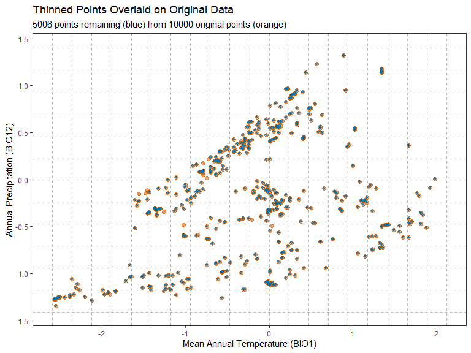

#### Method B: Deterministic Thinning with `thin_env_center`

This method is simpler as it does not require choosing a cap. It returns
one point for every occupied grid cell.

``` r
thinned_data_center <- thin_env_center(
  data = occ_data,
  env_vars = c("BIO1", "BIO12"),
  grid_resolution = grid_res
)

thinned_data_center
#> --- Bean Deterministic Thinning Results ---
#> 
#> Thinned 10000 original points to 289 unique grid cell centers.
```

#### Create the Thinned Center Data with Grid

``` r
ggplot() +
  # 1. Plot the original data points as a faded background
  geom_point(data = occ_data, 
             aes(x = BIO1, y = BIO12), 
             color = "grey40", alpha = 0.5, size = 1.5) + 
  # 2. Add the grid lines
  geom_vline(xintercept = x_breaks, color = "grey70", linetype = "dashed", linewidth = 0.5) +
  geom_hline(yintercept = y_breaks, color = "grey70", linetype = "dashed", linewidth = 0.5) +
  
  # 3. Plot the new grid cell centers on top
  geom_point(data = thinned_data_center$thinned_points, 
             aes(x = BIO1, y = BIO12), 
             color = "#D55E00", size = 2, shape = 3, stroke = 1) +
  
  # 4. Add informative labels
  labs(
    title = "Deterministic Thinning to Grid Cell Centers",
    subtitle = paste(nrow(thinned_data_center$thinned_points), 
                     "unique cell centers (orange crosses) from", 
                     nrow(thinned_data_center$original_points), 
                     "original points (grey)"),
    x = "Mean Annual Temperature (BIO1)",
    y = "Annual Precipitation (BIO12)"
  ) +
  theme_bw() +
  theme(panel.grid.major = element_blank(),
    panel.grid.minor = element_blank(),
    panel.background = element_blank())
```

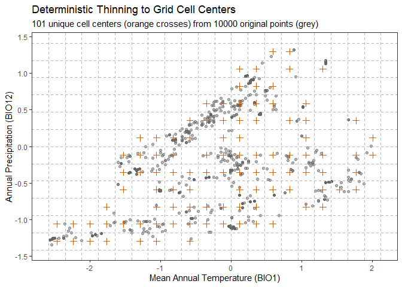

### Step 5: Delineate and Visualize the Niche Ellipse

The final step is to take the cleaned, thinned occurrence points and
formalize the environmental niche by fitting a bivariate ellipse. The
`fit_ellipsoid()` function delineates this niche boundary.

### Thinned Density Ellipsoid

``` r
# Fit an ellipse that contains 95% of the thinned data
niche_ellipse <- fit_ellipsoid(data = thinned_data$thinned_data, 
                               var1 = "BIO1", 
                               var2 = "BIO12", 
                               method = "covmat", 
                               level = 95)
# The returned object contains all the details
# We can use the custom print() method for a clean summary
niche_ellipse
#> --- Bean Environmental Niche Ellipse ---
#> 
#> Fitted to 8000 data points at a 9500.00% confidence level.
#> 7495 out of 8000 points (93.7%) fall within the ellipse boundary.
#> 
#> Niche Centroid (Mean Vector):
#>       BIO1      BIO12 
#> -0.6284533 -0.3699975

# And we can use the custom plot() method for a powerful visualization
plot(niche_ellipse)
```

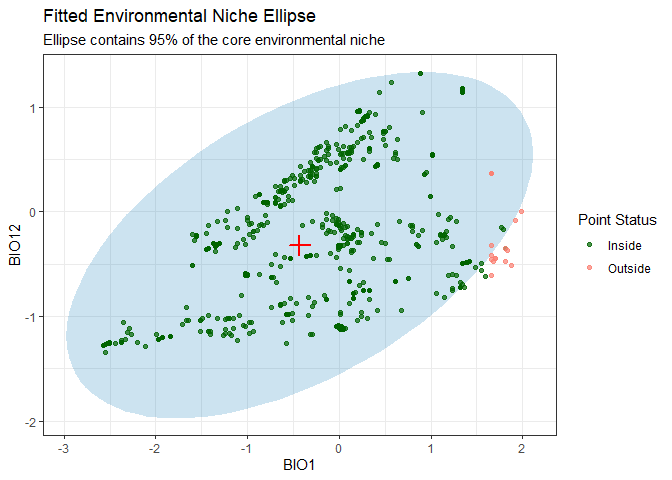

### Thinned Center Ellipsoid

``` r
# Fit an ellipse that contains 95% of the thinned data
center_niche_ellipse <- fit_ellipsoid(data = thinned_data_center$thinned_points,
                                      var1 = "BIO1", 
                                      var2 = "BIO12", 
                                      method = "covmat", 
                                      level = 95)
# The returned object contains all the details
# We can use the custom print() method for a clean summary
center_niche_ellipse
#> --- Bean Environmental Niche Ellipse ---
#> 
#> Fitted to 289 data points at a 9500.00% confidence level.
#> 283 out of 289 points (97.9%) fall within the ellipse boundary.
#> 
#> Niche Centroid (Mean Vector):
#>       BIO1      BIO12 
#> -0.1781544 -0.2234346

# And we can use the custom plot() method for a powerful visualization
plot(center_niche_ellipse)
```

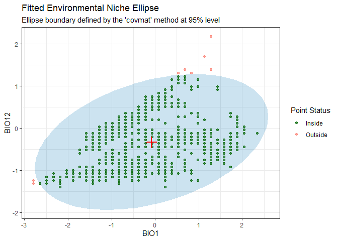

### Step 6: Evaluate Model Performance

This is the most important step: did the thinning actually improve our
model? We will build and evaluate two sets of Maxent models—one with the
original (but cleaned) data and one with the `bean`-thinned data—and
then statistically compare their performance using a t-test.

``` r
# --- 1. Prepare Environmental and Background Data ---
# Load the climate rasters from the package's 'inst/extdata' directory
bio1_file <- system.file("extdata", 
                         "BIO1.tif", 
                         package = "bean")
bio12_file <- system.file("extdata",  
                          "BIO12.tif",
                          package = "bean")
env_rasters <- scale(raster::stack(bio1_file, bio12_file))
plot(env_rasters)
```

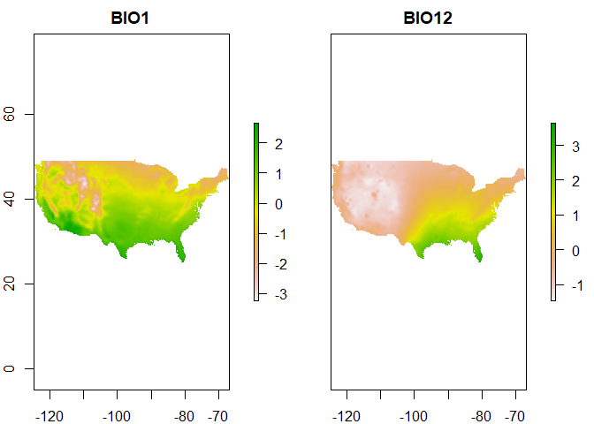

``` r

# Create background points by sampling from the study area
background_points <- randomPoints(env_rasters, 1000)
```

``` r
# --- 2. Run Evaluation on ORIGINAL Data ---
# Note: In a real analysis, use a higher n_repeats (e.g., 50 or 100).
# We use a small number here so the example runs quickly.
auc_original <- test_model_auc(
  presence_data = occ_data, # Use original, unscaled data for modeling
  background_data = as.data.frame(background_points),
  env_rasters = env_rasters,
  longitude = "x",
  latitude = "y", 
  k = 5, 
  n_repeats = 20,
  maxent_args = c("linear=true", 
                  "quadratic=true", 
                  "product=false",
                  "threshold=false", 
                  "hinge=false", 
                  "doclamp=true")
)
#> Starting 20 repetitions of 5-fold cross-validation...
#>   - Repetition 1 of 20...
#>   - Repetition 2 of 20...
#>   - Repetition 3 of 20...
#>   - Repetition 4 of 20...
#>   - Repetition 5 of 20...
#>   - Repetition 6 of 20...
#>   - Repetition 7 of 20...
#>   - Repetition 8 of 20...
#>   - Repetition 9 of 20...
#>   - Repetition 10 of 20...
#>   - Repetition 11 of 20...
#>   - Repetition 12 of 20...
#>   - Repetition 13 of 20...
#>   - Repetition 14 of 20...
#>   - Repetition 15 of 20...
#>   - Repetition 16 of 20...
#>   - Repetition 17 of 20...
#>   - Repetition 18 of 20...
#>   - Repetition 19 of 20...
#>   - Repetition 20 of 20...
#> Validation complete.

auc_original
#> --- Bean Model Evaluation Results ---
#> 
#> Based on 20 repetitions of 5-fold cross-validation (100 total models).
#> 
#> Summary of AUC Scores:
#>   Mean_AUC SD_AUC Median_AUC Min_AUC Max_AUC
#> 1    0.708  0.005      0.707   0.697   0.718
#> 
#> To see the distribution of AUC scores, run plot(your_results_object).

plot(auc_original)
```

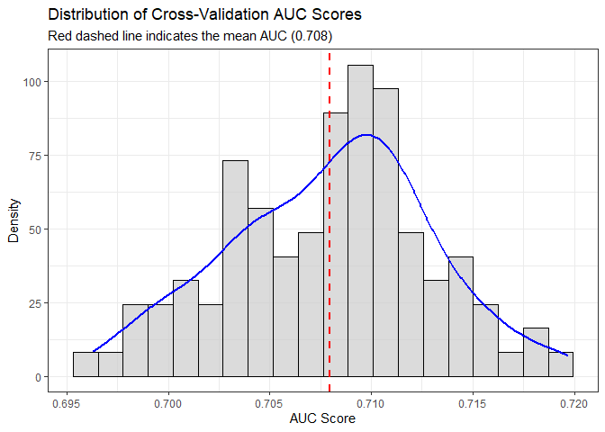

``` r
# --- 3. Run Evaluation on THINNED Data ---
auc_thinned <- test_model_auc(
  presence_data = as.data.frame(niche_ellipse$points_in_ellipse), # Use the thinned data frame
  background_data = as.data.frame(background_points),
  env_rasters = env_rasters,
  longitude = "x",
  latitude = "y", 
  k = 5, 
  n_repeats = 20,
  maxent_args = c("linear=true", 
                  "quadratic=true", 
                  "product=false",
                  "threshold=false", 
                  "hinge=false", 
                  "doclamp=true")
)
#> Starting 20 repetitions of 5-fold cross-validation...
#>   - Repetition 1 of 20...
#>   - Repetition 2 of 20...
#>   - Repetition 3 of 20...
#>   - Repetition 4 of 20...
#>   - Repetition 5 of 20...
#>   - Repetition 6 of 20...
#>   - Repetition 7 of 20...
#>   - Repetition 8 of 20...
#>   - Repetition 9 of 20...
#>   - Repetition 10 of 20...
#>   - Repetition 11 of 20...
#>   - Repetition 12 of 20...
#>   - Repetition 13 of 20...
#>   - Repetition 14 of 20...
#>   - Repetition 15 of 20...
#>   - Repetition 16 of 20...
#>   - Repetition 17 of 20...
#>   - Repetition 18 of 20...
#>   - Repetition 19 of 20...
#>   - Repetition 20 of 20...
#> Validation complete.

auc_thinned
#> --- Bean Model Evaluation Results ---
#> 
#> Based on 20 repetitions of 5-fold cross-validation (100 total models).
#> 
#> Summary of AUC Scores:
#>   Mean_AUC SD_AUC Median_AUC Min_AUC Max_AUC
#> 1    0.713  0.006      0.712   0.702   0.726
#> 
#> To see the distribution of AUC scores, run plot(your_results_object).

plot(auc_thinned)
```

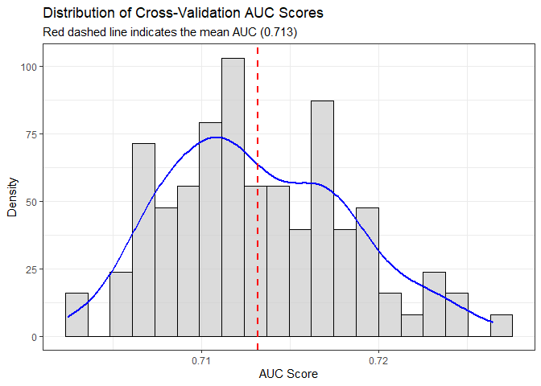

``` r
# --- 4. Statistically Compare the Results ---
# Perform a two-sample t-test
auc_ttest <- t.test(auc_original$all_auc_scores, auc_thinned$all_auc_scores)
auc_ttest
#> 
#>  Welch Two Sample t-test
#> 
#> data:  auc_original$all_auc_scores and auc_thinned$all_auc_scores
#> t = -6.9145, df = 189.01, p-value = 7.026e-11
#> alternative hypothesis: true difference in means is not equal to 0
#> 95 percent confidence interval:
#>  -0.006521696 -0.003626568
#> sample estimates:
#> mean of x mean of y 
#> 0.7078872 0.7129613

# --- 5. Visualize the Comparison ---
# Combine results into a data frame for plotting
results_df <- data.frame(
  AUC = c(auc_original$all_auc_scores, auc_thinned$all_auc_scores),
  DataType = factor(
    rep(c("Original", "Thinned"), 
        each = length(auc_original$all_auc_scores)), 
    levels = c("Original", "Thinned")
  )
)

# Create the final boxplot
ggplot(results_df, aes(x = DataType, y = AUC, fill = DataType)) +
  geom_boxplot(alpha = 0.7, width=0.5) +
  labs(
    title = "Comparison of Model Performance (AUC)",
    subtitle = "Comparing models built with original vs. bean-thinned data",
    x = "Presence Data Type",
    y = "Area Under Curve (AUC)"
  ) +
  scale_fill_manual(values = c("Original" = "#D55E00", "Thinned" = "#0072B2")) +
  theme_bw() +
  theme(legend.position = "none",
        plot.title = element_text(hjust = 0.5),
        plot.subtitle = element_text(hjust = 0.5)) +
  annotate("text", x = 1.5, y = min(results_df$AUC) * 0.99,
           label = paste("T-test p-value =", format.pval(auc_ttest$p.value, digits = 3)),
           hjust = 0.5, vjust = 0, fontface = "italic", size=4)
```

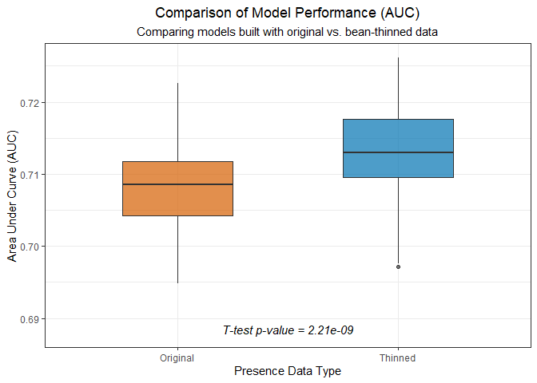

``` r

### The End ❤️
```
