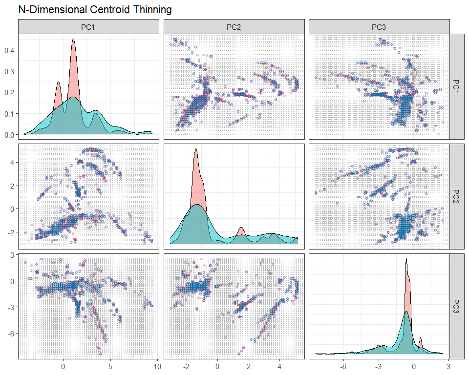

<!-- README.md is generated from README.Rmd. Please edit that file -->

# bean 🫛

<!-- badges: start -->

[](https://github.com/paanwaris/bean/actions/workflows/R-CMD-check.yaml)
[](https://app.codecov.io/gh/paanwaris/bean)
[](https://lifecycle.r-lib.org/articles/stages.html#experimental)
[](https://opensource.org/licenses/MIT)
<!-- badges: end -->

## Ecological Motivation

The `bean` package provides a tool to address a fundamental challenge in
species distribution modeling (SDM, or ecological niche modeling, ENM):
**sampling bias**. Occurrence records for species are rarely collected
through a systematic, stratified process. Instead, they often cluster in
easily accessible areas (like roads and cities) or in well-studied
research sites. This spatial bias can translate into an **environmental
bias**, where the model incorrectly learns that the species is
associated with the environmental conditions of those heavily sampled
areas, rather than its true ecological requirements.

`bean` tackles this problem by thinning occurrence data in
**environmental space**. The goal is to create a more uniform
distribution of points across the species’ observed environmental niche,
reducing the influence of densely clustered records. This allows for the
construction of a more accurate **fundamental niche** volume, which can
then be projected into geographic space to create a less biased
prediction of area with environmental suitability.

The name `bean` reflects the core principle of the method: ensuring that
each “pod” (a grid cell in environmental space) contains only a
specified number of “beans” (occurrence points).

## Installation

To use the package, you first need to install it from GitHub. The
following code will check for the required `devtools` package, install
it if necessary, and then install `bean`.

``` r
# 1. Install devtools if you don't have it yet
if (!require("devtools")) {
  install.packages("devtools")
}

# 2. Install bean from GitHub
devtools::install_github("paanwaris/bean")
```

## Package Loading

To perform the necessary analyses, we need several R packages for data
manipulation, visualization, and modeling.

``` r
# Load required libraries
library(bean)
library(dplyr)
library(ggplot2)
library(GGally)
library(terra)
library(raster)
library(rgl)
library(dismo)
```

## The `bean` Protocol: A Step-by-Step Guide

### Step 1: Data Preparation and Visualization

The first step is to load your raw species occurrence data and
environmental raster layers. It’s always a good practice to visualize
the spatial distribution of your points and inspect the environmental
layers.

``` r
# Load the raw occurrence data from the package
occ_file <- system.file("extdata", "Peromyscus_maniculatus_original.csv", package = "bean")
occ_data_raw <- read.csv(occ_file)

# Display the first few rows to understand its structure
head(occ_data_raw)
#>                  species          x        y
#> 1 Peromyscus maniculatus -119.47519 47.37757
#> 2 Peromyscus maniculatus -119.51685 34.42286
#> 3 Peromyscus maniculatus  -77.40364 39.08822
#> 4 Peromyscus maniculatus -122.59932 45.58640
#> 5 Peromyscus maniculatus -111.85233 34.83941
#> 6 Peromyscus maniculatus -117.22582 33.38149

# Visualize the spatial distribution of the occurrence points
ggplot(occ_data_raw, aes(x = x, y = y)) +
  geom_point(alpha = 0.5, color = "darkred") +
  labs(title = "Raw Occurrence Point Distribution") +
  theme_bw()
```


``` r
# Load the environmental raster layers
PC1_file <- system.file("extdata", "PC1.tif", package = "bean")
PC2_file <- system.file("extdata", "PC2.tif", package = "bean")
PC3_file <- system.file("extdata", "PC3.tif", package = "bean")
env_pca <- terra::rast(c(PC1_file, PC2_file, PC3_file))

# Plot the environmental layers to check their extent and values
plot(env_pca, mar = c(1, 1, 2, 4))
```


### Step 2: Prepare Data for Environmental Thinning

Before any analysis, the raw data must be cleaned and standardized. The
`prepare_bean()` function streamlines this process by: 1. Removing
records with missing coordinates. 2. Extracting environmental data for
each point from scaled raster layers. 3. Removing records that fall
outside the raster extent.

This ensures all subsequent functions work with a clean, complete, and
scaled dataset.

``` r
# Run the preparation function to clean and scale the data
origin_dat_prepared <- prepare_bean(
  data = occ_data_raw,
  env_rasters = env_pca,
  longitude = "x",
  latitude = "y",
  transform = "none"
)
#> Skipping raster transformation.
#> Extracting environmental data for occurrence points...
#> Data preparation complete. Returning 1588 clean records.

# View the structure and summary of the clean, scaled data
head(origin_dat_prepared)
#>                  species          x        y        PC1        PC2        PC3
#> 1 Peromyscus maniculatus -119.47519 47.37757 -1.5213782  1.7219400 -1.1818238
#> 2 Peromyscus maniculatus -119.51685 34.42286  3.0321994  5.1812487 -1.1879184
#> 3 Peromyscus maniculatus  -77.40364 39.08822  0.8128774 -0.8775375 -0.1797138
#> 4 Peromyscus maniculatus -122.59932 45.58640  1.3011913  2.0415363 -2.2844498
#> 5 Peromyscus maniculatus -111.85233 34.83941 -0.3278183  2.0679471 -0.1780916
#> 6 Peromyscus maniculatus -117.22582 33.38149  4.2337761  4.3437796 -1.5741526
summary(origin_dat_prepared)
#>    species                x                 y              PC1         
#>  Length:1588        Min.   :-124.35   Min.   :30.05   Min.   :-5.4286  
#>  Class :character   1st Qu.:-122.14   1st Qu.:38.46   1st Qu.:-1.5608  
#>  Mode  :character   Median :-113.85   Median :41.84   Median : 0.4583  
#>                     Mean   :-105.49   Mean   :41.49   Mean   : 0.3091  
#>                     3rd Qu.: -87.60   3rd Qu.:44.92   3rd Qu.: 2.0539  
#>                     Max.   : -67.16   Max.   :48.96   Max.   : 6.2050  
#>       PC2               PC3         
#>  Min.   :-3.9383   Min.   :-9.4809  
#>  1st Qu.:-1.4649   1st Qu.:-2.6345  
#>  Median : 0.9103   Median :-1.1812  
#>  Mean   : 0.6884   Mean   :-1.7195  
#>  3rd Qu.: 2.2570   3rd Qu.:-0.4589  
#>  Max.   : 5.2180   Max.   : 2.5078
```

### Step 3: Objective Grid Resolution using Pairwise Distances

The most critical parameter in environmental gridding is the
`grid_resolution`. Instead of guessing this value, we can derive it
objectively from the data by analyzing the **distribution of pairwise
environmental distances**.

The logic is to calculate the Euclidean distance between all pairs of
points in the (scaled) environmental space. The quantile of pairwise
distances to use for the resolution. A smaller quantile value (e.g.,
0.05-0.25) is generally recommended for gentle thinning. However, for
widespread generalists, a higher quantile (e.g., \> 0.75) may improve
model performance by more aggressively reducing large-scale bias

The `find_env_resolution()` function automates this process.

``` r
# Set a seed for reproducibility of the resampling in the correlogram
set.seed(81)  

# Let's set a low quantile value at 0.25
resolution_results <- find_env_resolution(
  data = origin_dat_prepared,
  env_vars = c("PC1", "PC2", "PC3"),
  quantile = 0.25
)
#> Calculating pairwise distances for each environmental axis...

# The function returns a suggested resolution and the full distance distribution
resolution_results
#> --- Bean Environmental Resolution Analysis ---
#> 
#> Suggested Grid Resolutions (at the 25% quantile):
#>   - PC1: 1.104589
#>   - PC2: 0.991350
#>   - PC3: 0.729171
#> 
#> To see the full distance distributions, run plot(your_results_object).

# We can also plot the distribution to visualize the analysis
# The blue line shows the distance at the chosen quantile.
plot(resolution_results)
```


``` r

# Let's use this objective resolution in the next step
grid_res <- resolution_results$suggested_resolution
```

### Step 4: Parameter Exploration with `find_optimal_cap()`

This is the most important step for ensuring a defensible thinning
strategy. Instead of guessing parameters, `find_optimal_cap()` allows
you to explore the trade-offs and make a data-driven choice.

**Key Parameters:** \* `grid_resolution`: This defines the size of the
cells in your environmental grid. The choice is ecologically
significant. A small value creates a fine grid, which is sensitive to
small environmental variations but may not thin large, dense clusters
effectively. A large value creates a coarse grid, which is better for
thinning broad-scale bias but may group distinct environmental
conditions together. \* `target_percent`: This is your goal for data
retention. A value of `0.8` means you want to keep approximately 80% of
your data. A value of `0.95` is recommended to remove 5% of the most
densely clustered points while retaining most of the data.

The function returns two key recommendations to guide your choice: 1.
`best_cap_closest`: The cap that results in a point count *numerically
closest* to your target. 2. `best_cap_above_target`: The cap that
results in a point count that is *closest to, but not below*, your
target. This is often the safer, more conservative choice if you want to
avoid losing too much data.

``` r
set.seed(81)
# Let's target retaining 95% of the data as recommended
optimal_params <- find_optimal_cap(
  data = origin_dat_prepared,
  env_vars = c("PC1", "PC2", "PC3"),
  grid_resolution = grid_res,
  target_percent = 0.95
)
#> Searching for optimal cap...
#>   |                                                                              |                                                                      |   0%  |                                                                              |=                                                                     |   2%  |                                                                              |==                                                                    |   4%  |                                                                              |====                                                                  |   5%  |                                                                              |=====                                                                 |   7%  |                                                                              |======                                                                |   9%  |                                                                              |=======                                                               |  11%  |                                                                              |=========                                                             |  12%  |                                                                              |==========                                                            |  14%  |                                                                              |===========                                                           |  16%  |                                                                              |============                                                          |  18%  |                                                                              |==============                                                        |  19%  |                                                                              |===============                                                       |  21%  |                                                                              |================                                                      |  23%  |                                                                              |=================                                                     |  25%  |                                                                              |==================                                                    |  26%  |                                                                              |====================                                                  |  28%  |                                                                              |=====================                                                 |  30%  |                                                                              |======================                                                |  32%  |                                                                              |=======================                                               |  33%  |                                                                              |=========================                                             |  35%  |                                                                              |==========================                                            |  37%  |                                                                              |===========================                                           |  39%  |                                                                              |============================                                          |  40%  |                                                                              |=============================                                         |  42%  |                                                                              |===============================                                       |  44%  |                                                                              |================================                                      |  46%  |                                                                              |=================================                                     |  47%  |                                                                              |==================================                                    |  49%  |                                                                              |====================================                                  |  51%  |                                                                              |=====================================                                 |  53%  |                                                                              |======================================                                |  54%  |                                                                              |=======================================                               |  56%  |                                                                              |=========================================                             |  58%  |                                                                              |==========================================                            |  60%  |                                                                              |===========================================                           |  61%  |                                                                              |============================================                          |  63%  |                                                                              |=============================================                         |  65%  |                                                                              |===============================================                       |  67%  |                                                                              |================================================                      |  68%  |                                                                              |=================================================                     |  70%  |                                                                              |==================================================                    |  72%  |                                                                              |====================================================                  |  74%  |                                                                              |=====================================================                 |  75%  |                                                                              |======================================================                |  77%  |                                                                              |=======================================================               |  79%  |                                                                              |========================================================              |  81%  |                                                                              |==========================================================            |  82%  |                                                                              |===========================================================           |  84%  |                                                                              |============================================================          |  86%  |                                                                              |=============================================================         |  88%  |                                                                              |===============================================================       |  89%  |                                                                              |================================================================      |  91%  |                                                                              |=================================================================     |  93%  |                                                                              |==================================================================    |  95%  |                                                                              |====================================================================  |  96%  |                                                                              |===================================================================== |  98%  |                                                                              |======================================================================| 100%

# The function automatically saves results to the output directory.
# We can also inspect the returned list object.
# Print the recommendations
optimal_params
#> --- Bean Optimization Results ---
#> 
#> Target: Retain >= 1508 occurrence points.
#> 
#> Recommendation for 'Closest to Target':
#>   - Best Cap: 35
#>   - Retained Points: 1505 (Difference of 3)
#> 
#> Recommendation for 'Closest Above Target' (Recommended for use):
#>   - Best Cap: 36
#>   - Retained Points: 1511
#> 
#> ---------------------------------

# Visualize the search process to understand the trade-offs
# The plot is also saved as a PNG in the output directory.
plot(optimal_params)
```


### Step 5: Apply Thinning

Now that we have an objective `grid_resolution` and an optimal
`max_per_cell`, we can apply the thinning. We offer two methods:
stochastic and deterministic.

#### Method A: Stochastic Thinning with `thin_env_density`

This method randomly samples up to `max_per_cell` points from each
occupied grid cell. It’s the most common approach.

``` r
# Use the recommended cap from the previous step
chosen_cap <- optimal_params$best_cap_above_target

# Apply the stochastic thinning
thinned_stochastic <- thin_env_nd(
  data = origin_dat_prepared,
  env_vars = c("PC1", "PC2", "PC3"),
  grid_resolution = grid_res, 
  max_per_cell = chosen_cap
)

# Print the summary of the thinning results
thinned_stochastic
#> --- Bean Stochastic Thinning Results ---
#> 
#> Thinned 1588 original points to 1511 points.
#> This represents a retention of 95.2% of the data.
#> 
#> --------------------------------------
head(thinned_stochastic$thinned_data)
#>                  species          x        y        PC1        PC2        PC3
#> 1 Peromyscus maniculatus -121.55794 48.41894 -0.9511238 -0.2456333 -3.3023946
#> 2 Peromyscus maniculatus  -98.31445 40.25456 -0.5898814 -0.5639865  2.1838503
#> 3 Peromyscus maniculatus  -84.48499 42.75386 -1.0902008 -1.6003426 -0.4679837
#> 4 Peromyscus maniculatus  -83.15203 42.08738 -0.3505672 -1.6335624 -0.5083243
#> 5 Peromyscus maniculatus  -83.98513 42.46228 -1.0073074 -1.5535607 -0.4518706
#> 6 Peromyscus maniculatus  -83.02707 42.54559 -1.0414460 -1.7014141 -0.4436147
```

#### Method B: Deterministic Thinning with `thin_env_center`

This method provides a simpler, non-random alternative. It returns a
single new point at the exact center of every occupied grid cell,
regardless of how many points were originally in it.

``` r
# Apply the deterministic thinning
thinned_deterministic <- thin_env_center(
  data = origin_dat_prepared,
  env_vars = c("PC1", "PC2", "PC3"),
  grid_resolution = grid_res
)

# Print the summary of the thinning results
thinned_deterministic
#> --- Bean Deterministic Thinning Results ---
#> 
#> Thinned 1588 original points to 257 unique grid cell centers.
#> 
#> -----------------------------------------
head(thinned_deterministic$thinned_points)
#>          PC1        PC2        PC3
#> 1 -1.6568831  1.4870256 -1.0937566
#> 2  2.7614719  5.4524273 -1.0937566
#> 3  0.5522944 -0.4956752 -0.3645855
#> 4  1.6568831  2.4783760 -2.5520988
#> 5 -0.5522944  2.4783760 -0.3645855
#> 6  3.8660606  4.4610769 -1.8229277
```

### Step 6: Visualize the Thinning Results

The `plot_bean()` function provides a powerful way to visualize the
effect of thinning by overlaying the thinned points on the original data
within the environmental grid.

``` r
# Visualize the stochastic thinning results
plot_stochastic <- plot_bean_nd(
  original_data = origin_dat_prepared,
  thinned_object = thinned_stochastic,
  env_vars = c("PC1", "PC2", "PC3")
)

# Visualize the deterministic thinning results
plot_deterministic <- plot_bean_nd(
  original_data = origin_dat_prepared,
  thinned_object = thinned_deterministic,
  env_vars = c("PC1", "PC2", "PC3")
)

# Display plots side-by-side (requires cowplot or similar package)
# cowplot::plot_grid(plot_stochastic, plot_deterministic)
plot_stochastic
```


``` r
plot_deterministic
```



### Step 7: Delineate and Visualize the Niche Ellipse

After thinning, we can formalize the environmental niche by fitting a
bivariate ellipse around the points. The `fit_ellipsoid()` function
delineates this boundary.

### Stochastic Thinned Ellipsoid

``` r
# Fit an ellipse that contains 95% of the thinned data
stochastic_ellipse <- fit_ellipsoid(data = thinned_stochastic$thinned_data, 
                                    env_vars = c("PC1", "PC2", "PC3"), 
                                    method = "covmat", 
                                    level = 0.95)
# The returned object contains all the details
# We can use the custom print() method for a clean summary
stochastic_ellipse
#> --- Bean Environmental Niche Ellipsoid ---
#> 
#> Method: 'covmat'.
#> Fitted in 3 dimensions to 1511 data points at a 95.00% level.
#> 1462 out of 1511 points (96.8%) fall within the ellipsoid boundary.
#> 
#> Niche Centroid:
#>        PC1        PC2        PC3 
#>  0.3597778  0.7756807 -1.7337123

# And we can use the custom plot() method for a powerful visualization
plot(stochastic_ellipse)
rgl::snapshot3d(knitr::fig_path(".png"))
#> Warning in rgl::snapshot3d(knitr::fig_path(".png")): webshot = TRUE requires
#> the webshot2 package and Chrome browser; using rgl.snapshot() instead
rgl::rgl.close()
#> Warning in rgl::rgl.close(): 'rgl::rgl.close' is deprecated.
#> Use 'close3d' instead.
#> See help("Deprecated")
```

### Deterministic Thinned Ellipsoid

``` r
# Fit an ellipse that contains 95% of the thinned data
deterministic_ellipse <- fit_ellipsoid(data = thinned_deterministic$thinned_points,
                                       env_vars = c("PC1", "PC2", "PC3"), 
                                       method = "covmat", 
                                       level = 0.95)
# The returned object contains all the details
# We can use the custom print() method for a clean summary
deterministic_ellipse
#> --- Bean Environmental Niche Ellipsoid ---
#> 
#> Method: 'covmat'.
#> Fitted in 3 dimensions to 257 data points at a 95.00% level.
#> 253 out of 257 points (98.4%) fall within the ellipsoid boundary.
#> 
#> Niche Centroid:
#>        PC1        PC2        PC3 
#>  0.6167645  0.8929869 -1.7491594

# And we can use the custom plot() method for a powerful visualization
plot(deterministic_ellipse)
rgl::snapshot3d(knitr::fig_path(".png"))
#> Warning in rgl::snapshot3d(knitr::fig_path(".png")): webshot = TRUE requires
#> the webshot2 package and Chrome browser; using rgl.snapshot() instead
rgl::rgl.close()
#> Warning in rgl::rgl.close(): 'rgl::rgl.close' is deprecated.
#> Use 'close3d' instead.
#> See help("Deprecated")
```

### Step 8: Evaluate Model Performance

Finally, we test whether thinning improved our model. We will build and
evaluate two sets of Maxent models—one with the original (but cleaned)
data and one with the `bean`-thinned data—and then statistically compare
their performance.

``` r
# Create background points by sampling from the study area
# Note: We use the unscaled rasters here for sampling background points.
set.seed(123)

# Create background points by sampling from the study area
background_points <- randomPoints(raster::stack(env_pca), 1000)
colnames(background_points) <- c("x", "y")
```

``` r
# --- Run Evaluation on ORIGINAL Data ---
# Note: In a real analysis, use a higher n_repeats (e.g., 50 or 100).
auc_original <- test_env_thinning(
  presence_data = origin_dat_prepared, # Use the cleaned, but unthinned data
  background_data = background_points,
  env_rasters = env_pca,
  longitude = "x",
  latitude = "y", 
  k = 5, 
  n_repeats = 20,
  maxent_args = c("linear=true", 
                  "quadratic=true", 
                  "product=false",
                  "threshold=false", 
                  "hinge=false", 
                  "doclamp=false")
)
#> Starting 20 repetitions of 5-fold cross-validation...
#>   - Repetition 1 of 20...
#>   - Repetition 2 of 20...
#>   - Repetition 3 of 20...
#>   - Repetition 4 of 20...
#>   - Repetition 5 of 20...
#>   - Repetition 6 of 20...
#>   - Repetition 7 of 20...
#>   - Repetition 8 of 20...
#>   - Repetition 9 of 20...
#>   - Repetition 10 of 20...
#>   - Repetition 11 of 20...
#>   - Repetition 12 of 20...
#>   - Repetition 13 of 20...
#>   - Repetition 14 of 20...
#>   - Repetition 15 of 20...
#>   - Repetition 16 of 20...
#>   - Repetition 17 of 20...
#>   - Repetition 18 of 20...
#>   - Repetition 19 of 20...
#>   - Repetition 20 of 20...
#> Validation complete.

auc_original
#> --- Bean Model Evaluation Results ---
#> 
#> Based on 20 repetitions of 5-fold cross-validation (100 total models).
#> 
#> Summary of AUC Scores:
#>   Mean_AUC SD_AUC Median_AUC Min_AUC Max_AUC
#> 1    0.803   0.01      0.803   0.779   0.827
#> 
#> To see the distribution of AUC scores, run plot(your_results_object).
plot(auc_original)
```


``` r
# --- Run Evaluation on THINNED Data ---
auc_thinned <- test_env_thinning(
  presence_data = stochastic_ellipse$points_in_ellipse, # Use the thinned data
  background_data = background_points,
  env_rasters = env_pca,
  longitude = "x",
  latitude = "y", 
  k = 5, 
  n_repeats = 20,
  maxent_args = c("linear=true", 
                  "quadratic=true", 
                  "product=false",
                  "threshold=false", 
                  "hinge=false", 
                  "doclamp=false")
)
#> Starting 20 repetitions of 5-fold cross-validation...
#>   - Repetition 1 of 20...
#>   - Repetition 2 of 20...
#>   - Repetition 3 of 20...
#>   - Repetition 4 of 20...
#>   - Repetition 5 of 20...
#>   - Repetition 6 of 20...
#>   - Repetition 7 of 20...
#>   - Repetition 8 of 20...
#>   - Repetition 9 of 20...
#>   - Repetition 10 of 20...
#>   - Repetition 11 of 20...
#>   - Repetition 12 of 20...
#>   - Repetition 13 of 20...
#>   - Repetition 14 of 20...
#>   - Repetition 15 of 20...
#>   - Repetition 16 of 20...
#>   - Repetition 17 of 20...
#>   - Repetition 18 of 20...
#>   - Repetition 19 of 20...
#>   - Repetition 20 of 20...
#> Validation complete.

auc_thinned
#> --- Bean Model Evaluation Results ---
#> 
#> Based on 20 repetitions of 5-fold cross-validation (100 total models).
#> 
#> Summary of AUC Scores:
#>   Mean_AUC SD_AUC Median_AUC Min_AUC Max_AUC
#> 1    0.801  0.011      0.801   0.777   0.828
#> 
#> To see the distribution of AUC scores, run plot(your_results_object).

plot(auc_thinned)
```


``` r
# --- Statistically Compare the Results ---
# Perform a two-sample t-test to see if the difference in AUC is significant
auc_ttest <- t.test(auc_original$all_auc_scores, auc_thinned$all_auc_scores)
auc_ttest
#> 
#>  Welch Two Sample t-test
#> 
#> data:  auc_original$all_auc_scores and auc_thinned$all_auc_scores
#> t = 0.72728, df = 195.87, p-value = 0.4679
#> alternative hypothesis: true difference in means is not equal to 0
#> 95 percent confidence interval:
#>  -0.001926445  0.004177385
#> sample estimates:
#> mean of x mean of y 
#> 0.8025970 0.8014716

# --- Visualize the Comparison ---
# Combine results into a data frame for plotting
results_df <- data.frame(
  AUC = c(auc_original$all_auc_scores, auc_thinned$all_auc_scores),
  DataType = factor(
    rep(c("Original", "Thinned"), 
        each = length(auc_original$all_auc_scores)), 
    levels = c("Original", "Thinned")
  )
)

# Create the final comparison boxplot
ggplot(results_df, aes(x = DataType, y = AUC, fill = DataType)) +
  geom_boxplot(alpha = 0.7, width = 0.5) +
  labs(
    title = "Comparison of Model Performance (AUC)",
    subtitle = "Comparing models built with original vs. bean-thinned data",
    x = "Presence Data Type",
    y = "Area Under Curve (AUC)"
  ) +
  scale_fill_manual(values = c("Original" = "#D55E00", "Thinned" = "#0072B2")) +
  theme_bw() +
  theme(legend.position = "none",
        plot.title = element_text(hjust = 0.5),
        plot.subtitle = element_text(hjust = 0.5)) +
  annotate("text", x = 1.5, y = min(results_df$AUC) * 0.99,
           label = paste("T-test p-value =", format.pval(auc_ttest$p.value, digits = 3)),
           hjust = 0.5, vjust = 0, fontface = "italic", size = 4)
```


### Step 7: Automated Calibration with `calibrate_bean`

The manual steps above are excellent for understanding the process, but
the `calibrate_bean()` function automates the entire workflow. It is the
“final boss” of the package, testing multiple combinations of thinning
parameters (`quantile`, `method`, `cap`) and identifying the single best
set based on final model performance (AUC). It also provides statistical
comparisons against baseline models.

## Generalist Model Calibration

``` r
# Print the summary table to see the best combination of parameters
generalist_calibration
#> --- Bean Parameter Calibration Results ---
#> 
#> Search Summary (sorted by performance):
#> # A tibble: 41 × 6
#>    combination     mean_auc sd_auc p_value_vs_original significance group     
#>    <chr>              <dbl>  <dbl> <chr>               <chr>        <chr>     
#>  1 q0.25_mve          0.81   0.013 0.011               *            d         
#>  2 q0.85_mve          0.81   0.01  0.028               *            df        
#>  3 q0.65_mve          0.809  0.01  0.036               *            df        
#>  4 Original_mve       0.808  0.01  0.755               ns           abdefg    
#>  5 q0.45_mve          0.808  0.011 0.330               ns           adf       
#>  6 q0.10_mve          0.807  0.011 0.716               ns           adf       
#>  7 q0.80_mve          0.807  0.013 0.837               ns           adfg      
#>  8 q0.40_mve          0.806  0.011 0.959               ns           adefg     
#>  9 q0.05_mve          0.806  0.013 0.971               ns           abdefg    
#> 10 q0.45_covmat       0.805  0.01  1.000               ns           abcdefg   
#> 11 q0.10_covmat       0.805  0.011 1.000               ns           abcefg    
#> 12 q0.05_covmat       0.805  0.01  1.000               ns           abcefg    
#> 13 q0.40_covmat       0.805  0.01  1.000               ns           abcefg    
#> 14 q0.70_covmat       0.805  0.01  1.000               ns           abcefg    
#> 15 q0.15_mve          0.805  0.013 1.000               ns           abcefg    
#> 16 q0.80_covmat       0.804  0.01  1.000               ns           abceg     
#> 17 Original_covmat    0.804  0.012 1.000               ns           abcdefgh  
#> 18 q0.75_covmat       0.804  0.01  1.000               ns           abceg     
#> 19 q0.60_mve          0.804  0.014 1.000               ns           abceg     
#> 20 q0.35_covmat       0.804  0.009 1.000               ns           abcegh    
#> 21 q0.55_covmat       0.804  0.01  1.000               ns           abcegh    
#> 22 q0.35_mve          0.804  0.01  1.000               ns           abcegh    
#> 23 q0.75_mve          0.804  0.012 1.000               ns           abcegh    
#> 24 q0.65_covmat       0.804  0.01  1.000               ns           abcegh    
#> 25 q0.20_mve          0.803  0.012 1.000               ns           abcegh    
#> 26 q0.60_covmat       0.803  0.01  1.000               ns           abcegh    
#> 27 Original           0.802  0.01  NA                  NA           abceghijkl
#> 28 q0.50_covmat       0.802  0.01  1.000               ns           bcegh     
#> 29 q0.85_covmat       0.802  0.01  1.000               ns           bcehj     
#> 30 q0.15_covmat       0.802  0.009 1.000               ns           bchij     
#> 31 q0.55_mve          0.802  0.01  1.000               ns           bchij     
#> 32 q0.25_covmat       0.801  0.011 1.000               ns           chij      
#> 33 q0.70_mve          0.801  0.011 1.000               ns           chijk     
#> 34 q0.30_covmat       0.801  0.009 1.000               ns           chijkl    
#> 35 q0.20_covmat       0.799  0.01  0.999               ns           hijkl     
#> 36 q0.95_mve          0.797  0.013 0.632               ns           ijkl      
#> 37 q0.90_mve          0.797  0.012 0.577               ns           ijkl      
#> 38 q0.50_mve          0.797  0.011 0.391               ns           ikl       
#> 39 q0.30_mve          0.797  0.011 0.269               ns           kl        
#> 40 q0.90_covmat       0.796  0.011 0.143               ns           l         
#> 41 q0.95_covmat       0.796  0.009 0.092               ns           l         
#> 
#> --- Best Combination ---
#> Optimal Quantile: 0.250
#> Optimal Ellipse Method: 'mve'
#> Resulting Grid Resolution:
#>   - PC1: 1.1046
#>   - PC2: 0.9914
#>   - PC3: 0.7292
#> Resulting Thinning Cap: 36
#> ---
#> Significance stars (*) indicate p-value from a pairwise comparison against the 'Original' baseline model.
#> Signif. codes: '***' p < 0.001,  '**' p < 0.01,  '*' p < 0.05,  'ns' p >= 0.05
#> Models sharing a letter in the 'group' column are not significantly different from each other (Tukey's HSD).

# Plot the results to visualize the performance trade-offs
plot(generalist_calibration)
```


``` r

# You can now access the final, best-thinned data directly for your final model
generalist_data <- generalist_calibration$best_points_in_ellipse
head(generalist_data)
#>                  species          x        y        PC1        PC2        PC3
#> 1 Peromyscus maniculatus -121.55794 48.41894 -0.9511238 -0.2456333 -3.3023946
#> 2 Peromyscus maniculatus  -98.31445 40.25456 -0.5898814 -0.5639865  2.1838503
#> 3 Peromyscus maniculatus  -83.98513 42.46228 -1.0073074 -1.5535607 -0.4518706
#> 4 Peromyscus maniculatus  -85.40140 42.04573 -0.4857600 -1.2387778 -0.2311740
#> 5 Peromyscus maniculatus  -83.98513 42.46228 -1.0073074 -1.5535607 -0.4518706
#> 6 Peromyscus maniculatus  -83.02707 42.54559 -1.0414460 -1.7014141 -0.4436147
```

## Specialist Model Calibration

``` r
# Print the summary table to see the best combination of parameters
specialist_calibration
#> --- Bean Parameter Calibration Results ---
#> 
#> Search Summary (sorted by performance):
#> # A tibble: 41 × 6
#>    combination     mean_auc sd_auc p_value_vs_original significance group 
#>    <chr>              <dbl>  <dbl> <chr>               <chr>        <chr> 
#>  1 Original_covmat    0.992  0.002 < 2e-16             ***          a     
#>  2 q0.95_covmat       0.992  0.003 < 2e-16             ***          a     
#>  3 q0.05_covmat       0.992  0.003 < 2e-16             ***          a     
#>  4 q0.10_covmat       0.991  0.002 < 2e-16             ***          a     
#>  5 q0.20_covmat       0.991  0.003 < 2e-16             ***          a     
#>  6 q0.25_covmat       0.991  0.003 < 2e-16             ***          a     
#>  7 q0.85_covmat       0.991  0.003 < 2e-16             ***          a     
#>  8 q0.70_covmat       0.991  0.003 < 2e-16             ***          a     
#>  9 q0.15_covmat       0.991  0.003 < 2e-16             ***          a     
#> 10 q0.75_covmat       0.991  0.003 < 2e-16             ***          a     
#> 11 q0.65_covmat       0.991  0.003 < 2e-16             ***          a     
#> 12 q0.80_covmat       0.991  0.003 < 2e-16             ***          a     
#> 13 q0.90_covmat       0.991  0.003 < 2e-16             ***          a     
#> 14 q0.55_covmat       0.991  0.003 < 2e-16             ***          a     
#> 15 q0.60_covmat       0.991  0.003 < 2e-16             ***          a     
#> 16 q0.30_covmat       0.991  0.003 < 2e-16             ***          a     
#> 17 q0.35_covmat       0.991  0.003 < 2e-16             ***          a     
#> 18 q0.50_covmat       0.991  0.003 < 2e-16             ***          a     
#> 19 q0.40_covmat       0.991  0.002 < 2e-16             ***          a     
#> 20 q0.45_covmat       0.991  0.003 < 2e-16             ***          a     
#> 21 q0.10_mve          0.988  0.004 4.2e-13             ***          b     
#> 22 q0.05_mve          0.988  0.003 1.1e-11             ***          bc    
#> 23 q0.15_mve          0.987  0.004 2.7e-10             ***          bcd   
#> 24 q0.65_mve          0.987  0.004 1.3e-09             ***          bcde  
#> 25 q0.20_mve          0.987  0.004 3.9e-08             ***          bcdef 
#> 26 q0.25_mve          0.987  0.004 1.0e-07             ***          bcdef 
#> 27 q0.70_mve          0.987  0.004 2.7e-06             ***          bcdefg
#> 28 q0.45_mve          0.987  0.004 7.0e-06             ***          bcdefg
#> 29 Original_mve       0.987  0.005 0.00254             **           bcdefg
#> 30 q0.95_mve          0.986  0.004 5.4e-05             ***          bcdefg
#> 31 q0.85_mve          0.986  0.004 7.5e-05             ***          bcdefg
#> 32 q0.50_mve          0.986  0.005 0.00016             ***          bcdefg
#> 33 q0.40_mve          0.986  0.005 0.00040             ***          cdefg 
#> 34 q0.60_mve          0.986  0.004 0.00058             ***          cdefg 
#> 35 q0.30_mve          0.986  0.004 0.00068             ***          cdefg 
#> 36 q0.90_mve          0.986  0.004 0.00080             ***          defg  
#> 37 q0.35_mve          0.986  0.004 0.00179             **           defg  
#> 38 q0.75_mve          0.986  0.005 0.00507             **           efg   
#> 39 q0.55_mve          0.985  0.004 0.06185             ns           fgh   
#> 40 q0.80_mve          0.985  0.004 0.19895             ns           gh    
#> 41 Original           0.983  0.004 NA                  NA           h     
#> 
#> --- Best Combination ---
#> Optimal Quantile: 0.950
#> Optimal Ellipse Method: 'covmat'
#> Resulting Grid Resolution:
#>   - PC1: 1.7648
#>   - PC2: 2.3352
#>   - PC3: 2.3606
#> Resulting Thinning Cap: 42
#> ---
#> Significance stars (*) indicate p-value from a pairwise comparison against the 'Original' baseline model.
#> Signif. codes: '***' p < 0.001,  '**' p < 0.01,  '*' p < 0.05,  'ns' p >= 0.05
#> Models sharing a letter in the 'group' column are not significantly different from each other (Tukey's HSD).

# Plot the results to visualize the performance trade-offs
plot(specialist_calibration)
```


``` r

# You can now access the final, best-thinned data directly for your final model
specialist_data <- specialist_calibration$best_points_in_ellipse
head(specialist_data)
#>           species        y         x       PC1       PC2       PC3
#> 3 Lynx canadensis 44.80376 -70.76662 -2.766962 -2.234711 -1.775255
#> 4 Lynx canadensis 45.79533 -69.34596 -2.791968 -2.305363 -1.742363
#> 5 Lynx canadensis 45.99159 -69.21948 -2.882799 -2.314592 -1.611886
#> 6 Lynx canadensis 46.06965 -68.47697 -3.387130 -2.333576 -1.113026
#> 7 Lynx canadensis 46.12326 -68.57641 -3.339733 -2.328240 -1.136800
#> 8 Lynx canadensis 46.16111 -69.17126 -2.963235 -2.277617 -1.471623
```

### The End ❤️
