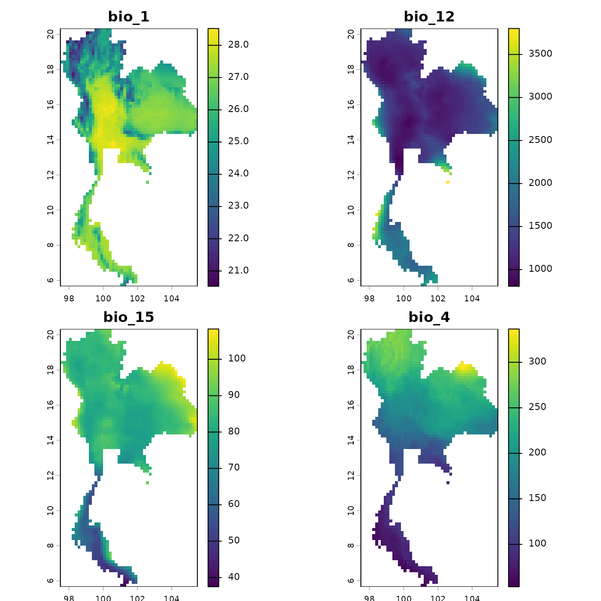
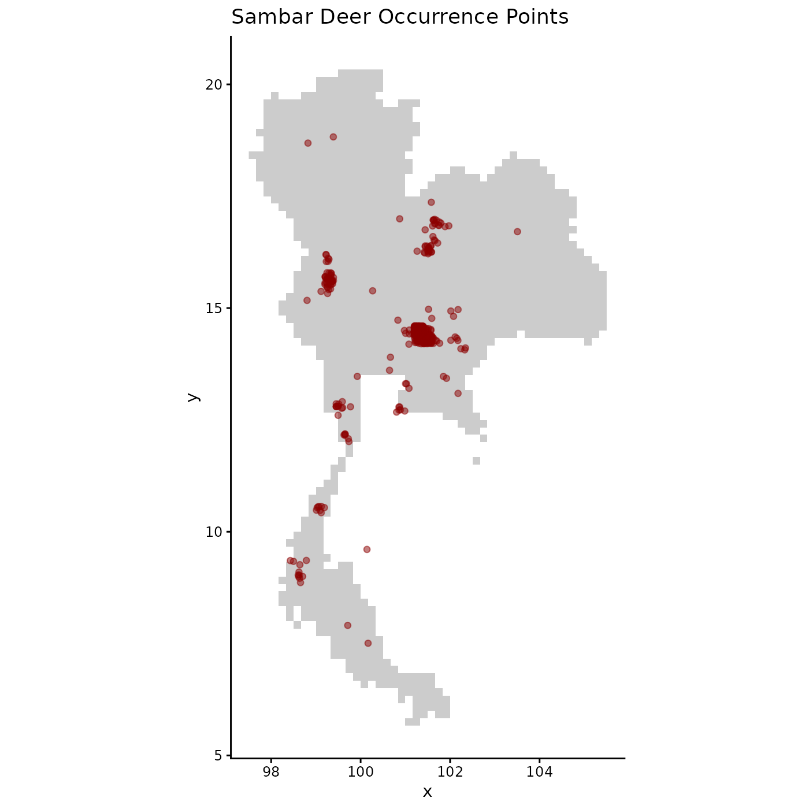
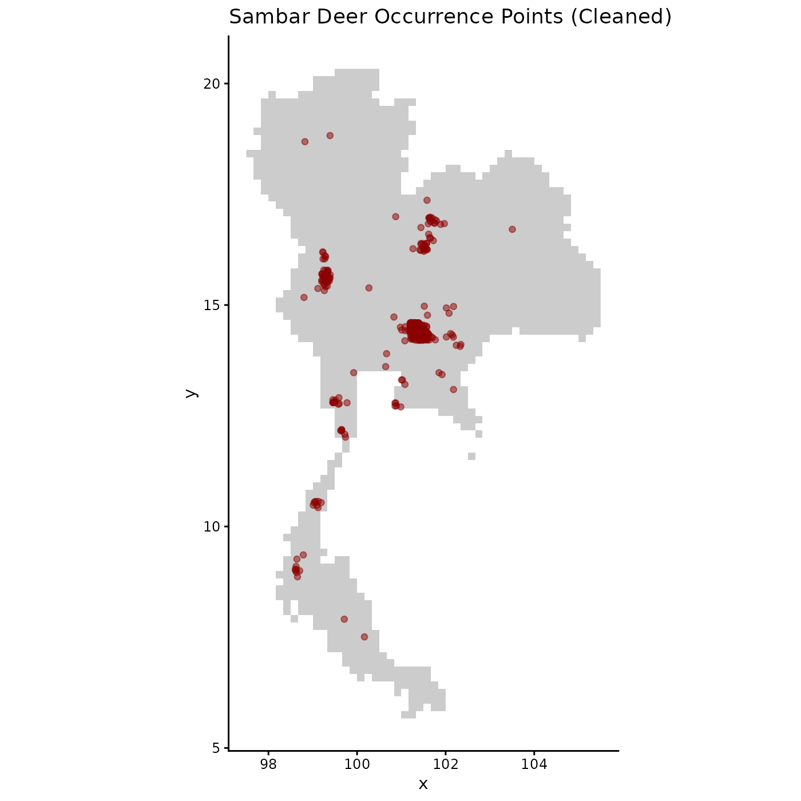

# Data preparation

Load the package

``` r

library(bean)
library(terra)
library(rgl)
library(ggplot2)
```

## Step 1: Import Data

The first step is to load your raw species occurrence data and
environmental raster layers. It’s always a good practice to visualize
the spatial distribution of your points and inspect the environmental
layers.

``` r

# Load the raw occurrence data from the package
occ_file <- system.file("extdata", "Rusa_unicolor.csv", package = "bean")
occ_data_raw <- read.csv(occ_file)

# Display the first few rows to understand its structure
head(occ_data_raw)
#>         species        y         x
#> 1 Rusa unicolor 15.37239  99.11555
#> 2 Rusa unicolor 15.41415  99.28763
#> 3 Rusa unicolor 14.46838 101.22005
#> 4 Rusa unicolor 15.65606  99.31600
#> 5 Rusa unicolor 14.39543 101.41694
#> 6 Rusa unicolor 12.72500 100.88947
```

``` r

# Load the environmental raster layers
thai_env_file <- system.file("extdata", "thai_env.tif", package = "bean")
env <- terra::rast(c(thai_env_file))

# Plot the environmental layers to check their extent and values
plot(env, mar = c(1, 1, 2, 4))
```



``` r

# Visualize the spatial distribution of the occurrence points
ggplot(occ_data_raw, aes(x = x, y = y)) +
  geom_raster(data = as.data.frame(env[[1]], xy = TRUE), aes(x = x, y = y), fill = "gray80") +
  geom_point(alpha = 0.5, color = "darkred") +
  coord_fixed() +
  labs(title = "Sambar Deer Occurrence Points") +
  theme_classic()
```



## Step 2: Prepare Data for Environmental Thinning

Before any analysis, the raw data must be cleaned and standardized. The
[`prepare_bean()`](https://paanwaris.github.io/bean/reference/prepare_bean.md)
function streamlines this process by:

1.  Removing records with missing coordinates.

2.  Extracting environmental data for each point from the raster layers.

3.  Removing records that fall outside the raster extent.

This ensures all subsequent functions work with a clean, complete, and
scaled dataset.

``` r

# Run the preparation function to clean and scale the data
origin_dat_prepared <- prepare_bean(
  data = occ_data_raw,
  env_rasters = env,
  longitude = "x",
  latitude = "y",
  transform = "none"
)
#> Skipping raster transformation.
#> Extracting environmental data for occurrence points...
#> 5 records removed because they fell outside the raster extent or had NA environmental values.
#> Data preparation complete. Returning 1024 clean records.

# View the structure and summary of the clean, scaled data
head(origin_dat_prepared)
#>         species        y         x    bio_1 bio_12   bio_15    bio_4
#> 1 Rusa unicolor 15.37239  99.11555 23.66463   1414 78.85445 175.0943
#> 2 Rusa unicolor 15.41415  99.28763 24.87193   1289 78.20957 180.2106
#> 3 Rusa unicolor 14.46838 101.22005 24.11074   1166 77.36796 173.1696
#> 4 Rusa unicolor 15.65606  99.31600 25.22871   1309 78.92366 186.1482
#> 5 Rusa unicolor 14.39543 101.41694 23.16356   1134 76.03447 182.5639
#> 6 Rusa unicolor 12.72500 100.88947 27.70646   1269 74.36774 123.1260
summary(origin_dat_prepared)
#>       species           y                x             bio_1      
#>  Length   :1024   Min.   : 7.508   Min.   : 98.6   Min.   :22.07  
#>  N.unique :   1   1st Qu.:14.414   1st Qu.:101.2   1st Qu.:23.16  
#>  N.blank  :   0   Median :14.450   Median :101.3   Median :24.11  
#>  Min.nchar:  13   Mean   :14.468   Mean   :101.2   Mean   :24.47  
#>  Max.nchar:  13   3rd Qu.:14.539   3rd Qu.:101.4   3rd Qu.:25.08  
#>                   Max.   :18.826   Max.   :103.5   Max.   :28.31  
#>      bio_12         bio_15          bio_4       
#>  Min.   : 806   Min.   :53.19   Min.   : 69.86  
#>  1st Qu.:1134   1st Qu.:76.03   1st Qu.:173.17  
#>  Median :1159   Median :77.37   Median :182.56  
#>  Mean   :1191   Mean   :76.98   Mean   :179.68  
#>  3rd Qu.:1176   3rd Qu.:77.57   3rd Qu.:188.16  
#>  Max.   :2803   Max.   :91.24   Max.   :268.08

# Visualize the spatial distribution of the cleaned occurrence points
ggplot(origin_dat_prepared, aes(x = x, y = y)) +
  geom_raster(data = as.data.frame(env[[1]], xy = TRUE), aes(x = x, y = y), fill = "gray80") +
  geom_point(alpha = 0.5, color = "darkred") +
  coord_fixed() +
  labs(title = "Sambar Deer Occurrence Points (Cleaned)") +
  theme_classic()
```


