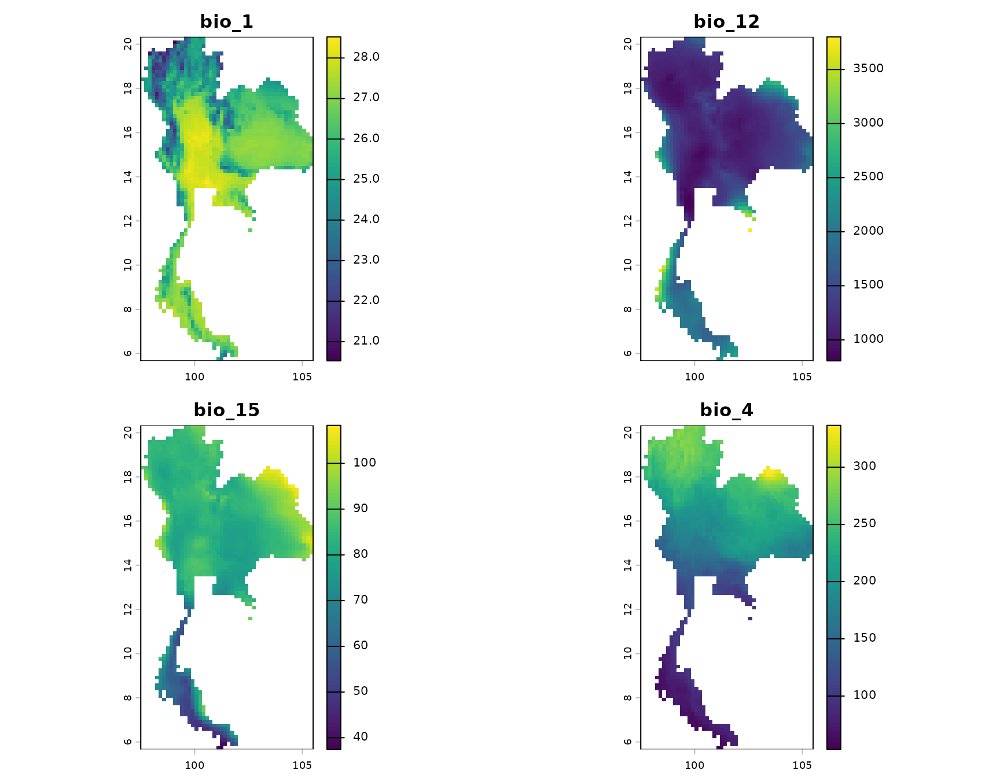
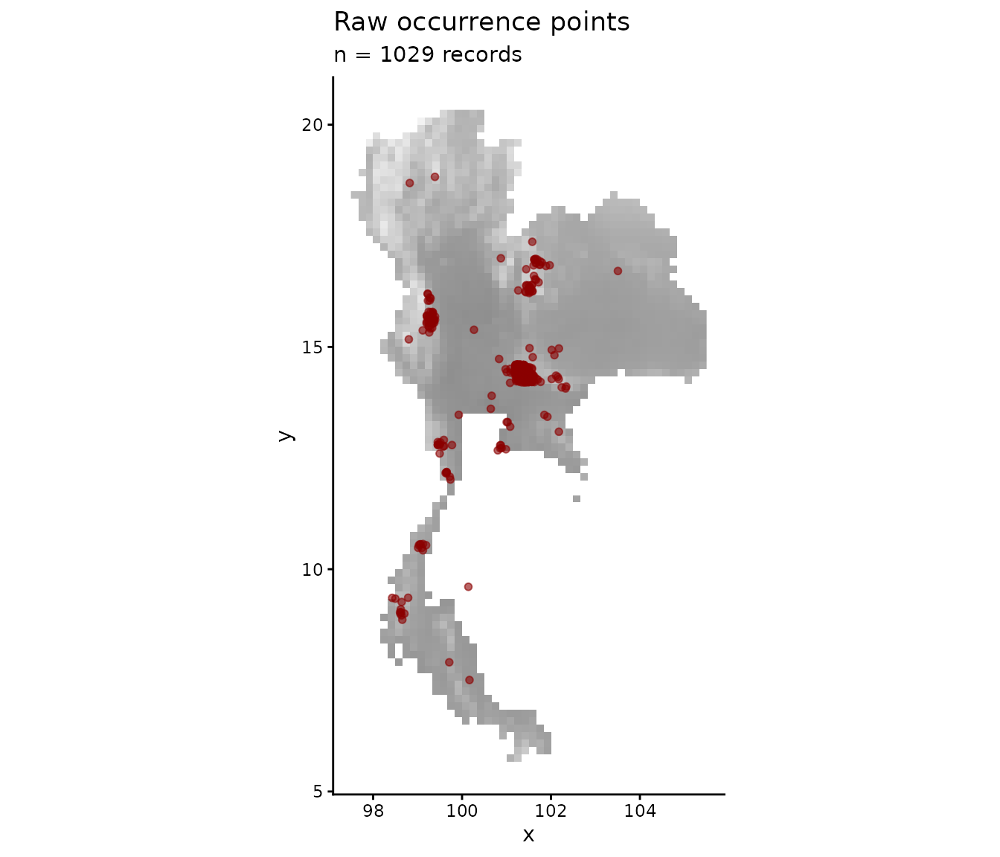
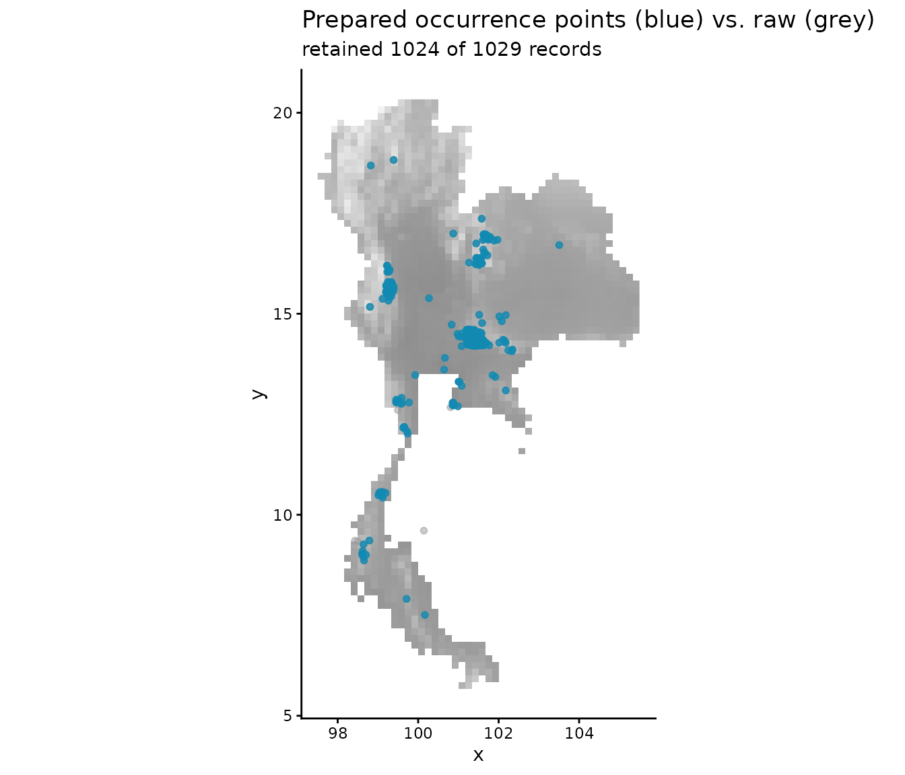

# 1. Data preparation

[`prepare_bean()`](https://paanwaris.github.io/bean/reference/prepare_bean.md)
cleans raw occurrence records and attaches environmental values to each
point. The function:

1.  drops records with missing coordinates;
2.  optionally standardises (`"scale"`) or PCA-rotates (`"pca"`) the
    environmental rasters before extraction;
3.  extracts environmental values for every occurrence;
4.  drops records that fall outside the raster extent.

## Load raw data

``` r

library(bean)
library(terra)

occ_file <- system.file("extdata", "Rusa_unicolor.csv", package = "bean")
env_file <- system.file("extdata", "thai_env.tif",     package = "bean")

occ_data_raw <- read.csv(occ_file)
env <- terra::rast(env_file)

head(occ_data_raw)
#>         species        y         x
#> 1 Rusa unicolor 15.37239  99.11555
#> 2 Rusa unicolor 15.41415  99.28763
#> 3 Rusa unicolor 14.46838 101.22005
#> 4 Rusa unicolor 15.65606  99.31600
#> 5 Rusa unicolor 14.39543 101.41694
#> 6 Rusa unicolor 12.72500 100.88947
env
#> class       : SpatRaster
#> size        : 88, 48, 4  (nrow, ncol, nlyr)
#> resolution  : 0.1666667, 0.1666667  (x, y)
#> extent      : 97.5, 105.5, 5.666667, 20.33333  (xmin, xmax, ymin, ymax)
#> coord. ref. : lon/lat WGS 84 (EPSG:4326)
#> source      : thai_env.tif
#> names       :     bio_1, bio_12,     bio_15,      bio_4
#> min values  : 20.527281,    806,   37.47298,  53.402359
#> max values  : 28.521406,   3802, 108.317207, 336.597565
```

## Visualise the environmental layers

``` r

plot(env, mar = c(1.5, 1.5, 2, 4))
```



## Visualise the raw occurrence points

The raw points are clearly clustered along roads and around cities — a
classic example of spatial sampling bias.

``` r

library(ggplot2)
env_df <- as.data.frame(env[[1]], xy = TRUE)

ggplot(occ_data_raw, aes(x, y)) +
  geom_raster(data = env_df, aes(x, y, fill = .data[[names(env)[1]]])) +
  geom_point(alpha = 0.6, colour = "darkred", size = 1.4) +
  scale_fill_gradient(low = "grey95", high = "grey55", guide = "none") +
  coord_fixed() +
  labs(title = "Raw occurrence points",
       subtitle = sprintf("n = %d records", nrow(occ_data_raw))) +
  theme_classic()
```



## Run `prepare_bean()`

``` r

prepared <- prepare_bean(
  data = occ_data_raw,
  env_rasters = env,
  longitude = "x",
  latitude = "y",
  transform = "scale"
)
#> Scaling environmental rasters...
#> Extracting environmental data for occurrence points...
#> 5 records removed because they fell outside the raster extent or had NA environmental values.
#> Data preparation complete. Returning 1024 clean records.
head(prepared)
#>         species        y         x      bio_1       bio_12     bio_15
#> 1 Rusa unicolor 15.37239  99.11555 -1.6909295  0.003511156 -0.2454693
#> 2 Rusa unicolor 15.41415  99.28763 -0.8711075 -0.267821213 -0.3053829
#> 3 Rusa unicolor 14.46838 101.22005 -1.3879976 -0.534812263 -0.3835742
#> 4 Rusa unicolor 15.65606  99.31600 -0.6288324 -0.224408034 -0.2390396
#> 5 Rusa unicolor 14.39543 101.41694 -2.0311866 -0.604273349 -0.5074636
#> 6 Rusa unicolor 12.72500 100.88947  1.0537073 -0.311234392 -0.6623129
#>        bio_4
#> 1 -0.2573387
#> 2 -0.1768698
#> 3 -0.2876102
#> 4 -0.0834852
#> 5 -0.1398570
#> 6 -1.0746857
summary(prepared[, -(1:3)])
#>      bio_1            bio_12            bio_15            bio_4        
#>  Min.   :-2.777   Min.   :-1.3162   Min.   :-2.6297   Min.   :-1.9125  
#>  1st Qu.:-2.031   1st Qu.:-0.6043   1st Qu.:-0.5075   1st Qu.:-0.2876  
#>  Median :-1.388   Median :-0.5500   Median :-0.3836   Median :-0.1399  
#>  Mean   :-1.143   Mean   :-0.4804   Mean   :-0.4194   Mean   :-0.1852  
#>  3rd Qu.:-0.731   3rd Qu.:-0.5131   3rd Qu.:-0.3648   3rd Qu.:-0.0518  
#>  Max.   : 1.461   Max.   : 3.0186   Max.   : 0.9055   Max.   : 1.2052
```

## Visualise the prepared points

After cleaning, the records that survived are mapped here in blue.
Points that were dropped (missing coordinates or outside the raster
extent) are shown in red for comparison.

``` r

ggplot() +
  geom_raster(data = env_df, aes(x, y, fill = .data[[names(env)[1]]])) +
  geom_point(data = occ_data_raw, aes(x, y),
             colour = "red", size = 1.4, alpha = 0.5) +
  geom_point(data = prepared, aes(x, y),
             colour = "#118ab2", size = 1.4, alpha = 0.8) +
  scale_fill_gradient(low = "grey95", high = "grey55", guide = "none") +
  coord_fixed() +
  labs(title = "Prepared occurrence points (blue) vs. raw (grey)",
       subtitle = sprintf("retained %d of %d records",
                          nrow(prepared), nrow(occ_data_raw))) +
  theme_classic()
```



## The shipped, pre-computed dataset

For users without `terra`, the package also ships the result of running
the same pipeline on the bundled rasters:

``` r

data(origin_dat_prepared, package = "bean")
head(origin_dat_prepared)
#>         species        y         x      bio_1       bio_12     bio_15
#> 1 Rusa unicolor 15.37239  99.11555 -1.6909295  0.003511156 -0.2454693
#> 2 Rusa unicolor 15.41415  99.28763 -0.8711075 -0.267821213 -0.3053829
#> 3 Rusa unicolor 14.46838 101.22005 -1.3879976 -0.534812263 -0.3835742
#> 4 Rusa unicolor 15.65606  99.31600 -0.6288324 -0.224408034 -0.2390396
#> 5 Rusa unicolor 14.39543 101.41694 -2.0311866 -0.604273349 -0.5074636
#> 6 Rusa unicolor 12.72500 100.88947  1.0537073 -0.311234392 -0.6623129
#>        bio_4
#> 1 -0.2573387
#> 2 -0.1768698
#> 3 -0.2876102
#> 4 -0.0834852
#> 5 -0.1398570
#> 6 -1.0746857
```

This is the object used in the next two vignettes.
