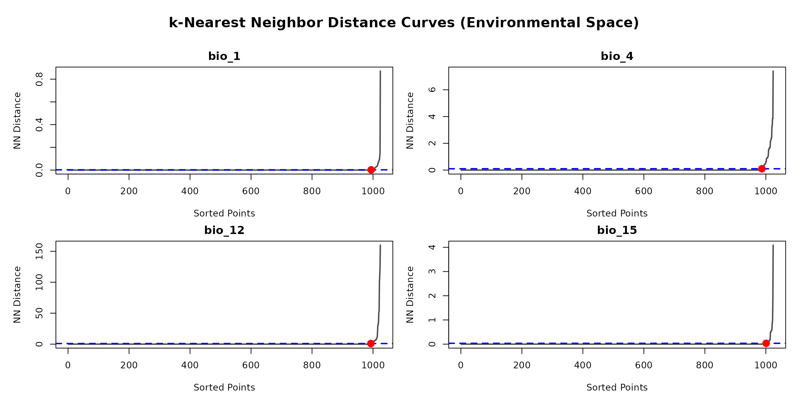

# Environmental thinning

Load the package

``` r

library(bean)
#> Warning in rgl.init(initValue, onlyNULL): RGL: unable to open X11 display
#> Warning: 'rgl.init' failed, will use the null device.
#> See '?rgl.useNULL' for ways to avoid this warning.
library(terra)
#> terra 1.9.27
library(rgl)
```

## Step 3: Objective Grid Resolution using Nearest Neighbors

The most critical parameter in environmental gridding is the
`grid_resolution`. Instead of guessing this value, we can derive it
objectively from the data by analyzing the density of points in
environmental space.

The
[`find_env_resolution()`](https://paanwaris.github.io/bean/reference/find_env_resolution.md)
function uses a geometric “elbow” method based on nearest-neighbor
distances. This identifies the exact distance where dense artificial
clustering transitions into natural data spacing, eliminating the need
for arbitrary quantiles.

``` r

data(origin_dat_prepared, package = "bean")
# Find the objective resolution using the elbow method
resolution_results <- find_env_resolution(
  data = origin_dat_prepared,
  env_vars = c("bio_1", "bio_4", "bio_12", "bio_15")
)
#> Calculating nearest neighbor environmental distances and detecting elbows...

plot(resolution_results)
```



``` r


# Let's use this objective resolution in the next step
grid_res <- resolution_results$suggested_resolution
grid_res
#>       bio_1       bio_4      bio_12      bio_15 
#> 0.002405167 0.098876953 1.000000000 0.034934998
```

## Step 4: Apply Thinning

Now that we have an objective, data-driven `grid_resolution`, we can
apply the thinning. We offer two methods: stochastic and deterministic.

### Method A: Stochastic Thinning with `thin_env_nd`

This method randomly samples exactly one point from each occupied grid
cell, enforcing strict presence-only logic within the environmental
hypercube.

``` r

# Apply the stochastic thinning (using a seed for reproducibility)
thinned_stochastic <- thin_env_nd(
  data = origin_dat_prepared,
  env_vars = c("bio_1","bio_4", "bio_12", "bio_15"),
  grid_resolution = grid_res
)

# Print the summary of the thinning results
thinned_stochastic
#> --- Bean Stochastic Thinning Results ---
#> 
#> Thinned 1024 original points to 78 points.
#> This represents a retention of 7.6% of the data.
#> 
#> --------------------------------------
head(thinned_stochastic$thinned_data)
#>           species        y         x    bio_1 bio_12   bio_15    bio_4
#> 945 Rusa unicolor 14.45169 101.29557 24.11074   1166 77.36796 173.1696
#> 807 Rusa unicolor 16.45394 101.72157 24.19963   1010 80.99183 225.2455
#> 968 Rusa unicolor 16.25104 101.57840 24.35942   1031 80.01744 209.8779
#> 919 Rusa unicolor 16.29003 101.49113 24.40832   1048 80.30025 207.4802
#> 812 Rusa unicolor 15.67431  99.28283 24.51126   1315 78.66610 186.7147
#> 484 Rusa unicolor 12.79893  99.45413 24.52396   1115 73.28954 110.6435
```

### Method B: Deterministic Thinning with `thin_env_center`

This method provides a simpler, non-random alternative. It returns a
single new point at the exact center of every occupied grid cell,
regardless of how many original points fell within it.

``` r

# Apply the deterministic thinning
thinned_deterministic <- thin_env_center(
  data = origin_dat_prepared,
  env_vars = c("bio_1","bio_4", "bio_12", "bio_15"),
  grid_resolution = c(0.5,0.5,0.5,0.5)
)

# Print the summary of the thinning results
thinned_deterministic
#> --- Bean Deterministic Thinning Results ---
#> 
#> Thinned 1024 original points to 78 unique grid cell centers.
#> This represents a retention of 7.6% of the data.
#> 
#> --------------------------------------
head(thinned_deterministic$thinned_points)
#>   bio_1  bio_4  bio_12 bio_15
#> 1 23.75 175.25 1414.25  78.75
#> 2 24.75 180.25 1289.25  78.25
#> 3 24.25 173.25 1166.25  77.25
#> 4 25.25 186.25 1309.25  78.75
#> 5 23.25 182.75 1134.25  76.25
#> 6 27.75 123.25 1269.25  74.25
```
