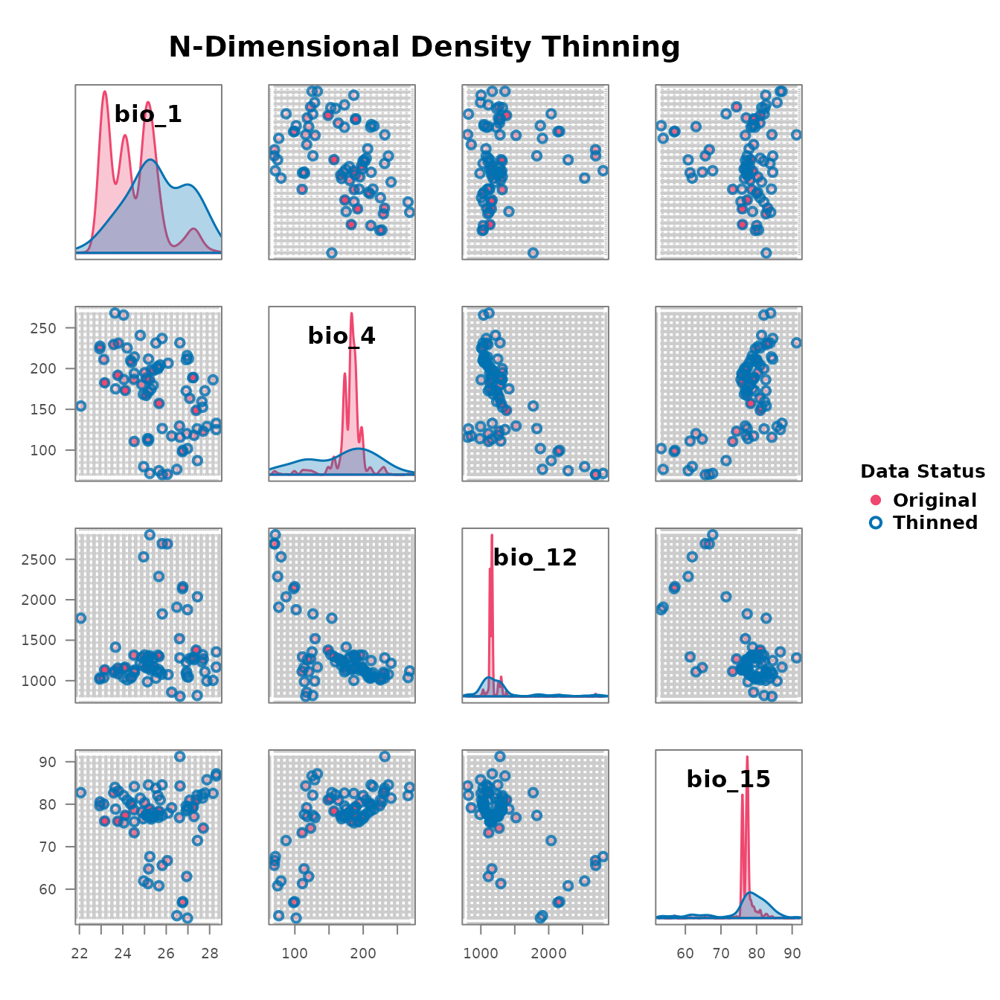

# 2. Environmental thinning

``` r

library(bean)
data(origin_dat_prepared, package = "bean")
env_vars <- c("bio_1", "bio_4", "bio_12", "bio_15")
```

## Choosing an objective grid resolution

[`find_env_resolution()`](https://paanwaris.github.io/bean/reference/find_env_resolution.md)
selects a **kernel-density bandwidth** for each environmental variable.
The bandwidth is the scale at which the empirical density of
observations becomes smooth, and is a statistically defensible choice
for the edge length of an environmental grid cell. The default selector
is the Sheather–Jones plug-in estimator (Sheather & Jones, 1991);
Silverman’s rule (`"silverman"`) and Scott’s rule (`"scott"`) are also
available.

``` r

res <- find_env_resolution(
  data     = origin_dat_prepared,
  env_vars = env_vars,
  method   = "sheather-jones"
)
res
#> --- Bean environmental grid resolution ---
#> Bandwidth selector: sheather-jones
#> 
#>  variable resolution
#>     bio_1 0.08274934
#>     bio_4 0.85162273
#>    bio_12 2.25907105
#>    bio_15 0.07070831
```

Visualise the per-variable kernel density and the chosen bandwidth:

``` r

plot(res)
```


## Stochastic thinning

[`thin_env_nd()`](https://paanwaris.github.io/bean/reference/thin_env_nd.md)
randomly retains exactly one occurrence per occupied grid cell. A `seed`
makes the selection reproducible without disturbing the global random
state.

``` r

thinned_stochastic <- thin_env_nd(
  data            = origin_dat_prepared,
  env_vars        = env_vars,
  grid_resolution = res$suggested_resolution,
  seed            = 1
)
thinned_stochastic
#> --- Bean Stochastic Thinning Results ---
#> 
#> Thinned 1024 original points to 78 points.
#> This represents a retention of 7.6% of the data.
#> 
#> --------------------------------------
```

## Deterministic thinning

[`thin_env_center()`](https://paanwaris.github.io/bean/reference/thin_env_center.md)
replaces each occupied cell with a single point at the geometric centre
of the cell. There is no randomness, so the result is exactly
reproducible.

``` r

thinned_deterministic <- thin_env_center(
  data            = origin_dat_prepared,
  env_vars        = env_vars,
  grid_resolution = res$suggested_resolution
)
thinned_deterministic
#> --- Bean Deterministic Thinning Results ---
#> 
#> Thinned 1024 original points to 78 unique grid cell centers.
#> This represents a retention of 7.6% of the data.
#> 
#> --------------------------------------
```

## Comparing original and thinned data

[`plot_bean()`](https://paanwaris.github.io/bean/reference/plot_bean.md)
overlays the thinned points on the original cloud in a scatterplot
matrix.

``` r

plot_bean(
  original_data  = origin_dat_prepared,
  thinned_object = thinned_stochastic,
  env_vars       = env_vars
)
```


