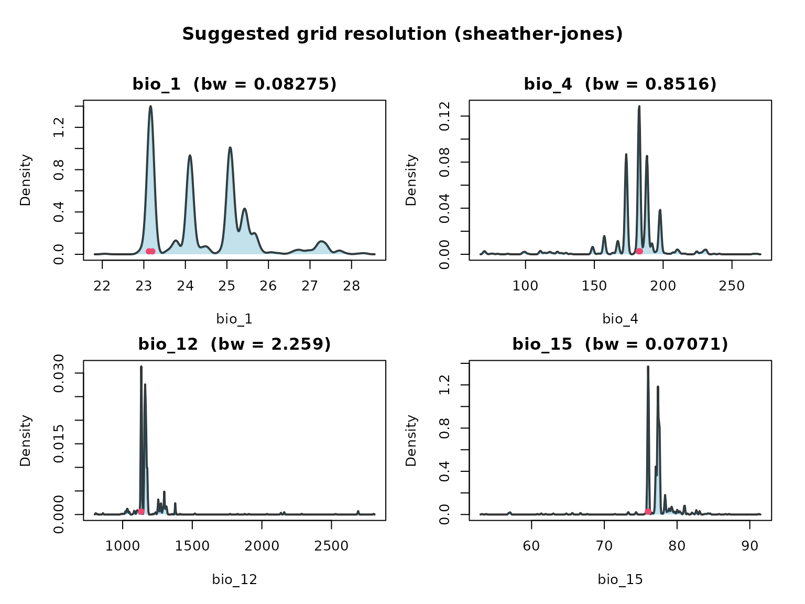
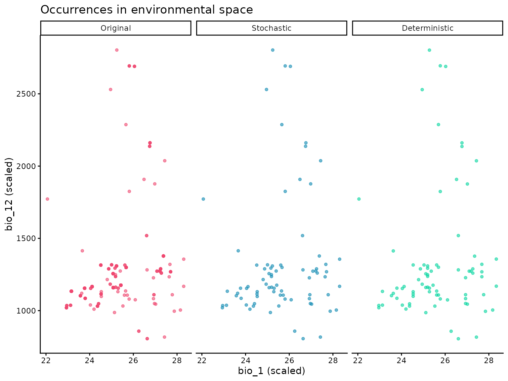
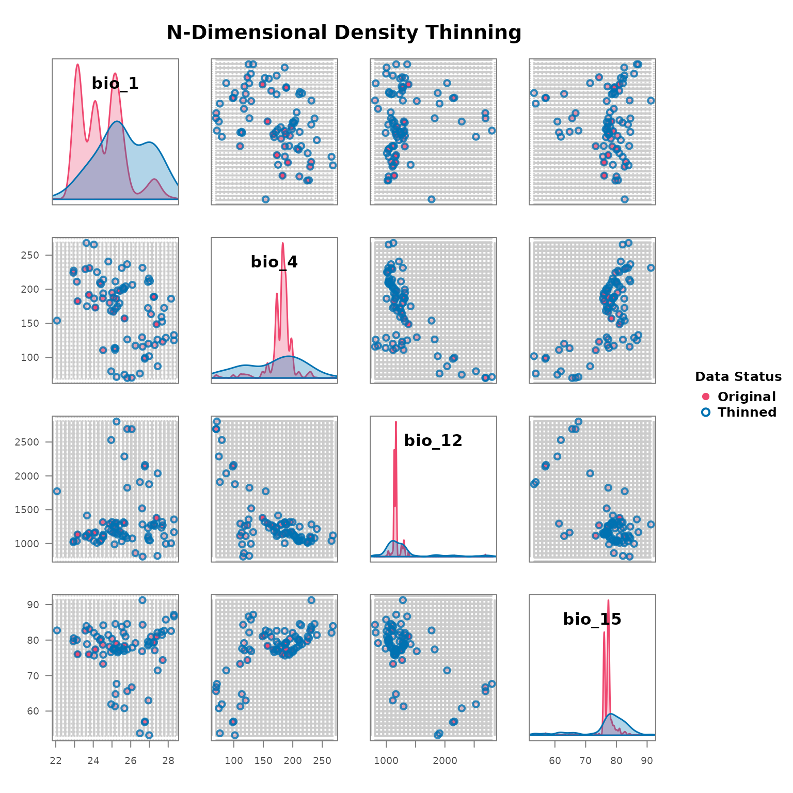

# 2. Environmental thinning

``` r

library(bean)
data(origin_dat_prepared, package = "bean")
env_vars <- c("bio_1", "bio_4", "bio_12", "bio_15")
```

## Choosing an objective grid resolution

### The intuition

A grid cell is the unit of “redundancy” in environmental space. If two
occurrences sit in the same cell, the package treats them as carrying
the same environmental information and keeps only one. Pick the cell too
small, and almost every point survives — thinning does nothing. Pick it
too large, and you wipe out genuine ecological variation. We need a
data-driven choice that sits between those two extremes.

### Why a kernel-density bandwidth?

A kernel density estimator (KDE) replaces every observation with a small
“bump” of width *h* (the **bandwidth**) and adds the bumps together to
estimate the probability density of the variable. The bandwidth is the
scale at which the estimator stops resolving individual points and
starts producing a smooth curve. Operationally:

- features finer than *h* are treated as sampling noise,
- features coarser than *h* are treated as real density structure.

That is exactly the dividing line a thinning grid should respect, so
[`find_env_resolution()`](https://paanwaris.github.io/bean/reference/find_env_resolution.md)
uses *h* (computed independently per variable) as the suggested edge
length of each cell.

### Which selector?

Three selectors with established statistical properties are available
via the `method` argument:

- **Sheather–Jones plug-in** (`"sheather-jones"`, the default) — solves
  an equation for the bandwidth that minimises the asymptotic mean
  integrated squared error of the density estimate. It uses the data
  itself (rather than a Gaussian assumption) to estimate the curvature
  of the unknown density, and is the modern standard recommendation
  (Sheather & Jones, 1991; Jones, Marron & Sheather, 1996).

- **Silverman’s rule of thumb** (`"silverman"`) — the closed form
  ``` math
  h = 0.9 \, \min\!\left(\hat\sigma,\, IQR/1.34\right) \, n^{-1/5}.
  ```
  Cheap, stable, and a good fallback. Uses the IQR-based scale to resist
  mild outliers, but assumes the underlying density is approximately
  Gaussian. Tends to over-smooth multimodal data (Silverman, 1986).

- **Scott’s rule** (`"scott"`) — the closed form
  ``` math
  h = 1.06 \, \hat\sigma \, n^{-1/5}.
  ```
  Optimal when the density is exactly Gaussian; otherwise less
  defensible than the other two (Scott, 1992).

All three rules shrink at the canonical rate $`n^{-1/5}`$: more data
buys you a finer resolution, but only slowly. This is the right
behaviour for SDM data — doubling your sample size should let you see
slightly finer structure, not arbitrarily finer.

### Computing the resolution

``` r

res <- find_env_resolution(
  data     = origin_dat_prepared,
  env_vars = env_vars,
  method   = "sheather-jones"
)
res
#> --- Bean environmental grid resolution ---
#> Bandwidth selector: sheather-jones
#> 
#>  variable resolution
#>     bio_1 0.08274934
#>     bio_4 0.85162273
#>    bio_12 2.25907105
#>    bio_15 0.07070831
```

### Visualising the bandwidth

Each panel below shows the per-variable kernel density. The red bar at
the bottom of each panel has length equal to the chosen bandwidth — the
cell width that will be used for thinning.

``` r

plot(res)
```



### Sensitivity to the selector

It’s worth checking that the three rules give comparable answers; if
they don’t, the data is far from Gaussian and you may want to inspect
the densities yourself.

``` r

sapply(c("sheather-jones", "silverman", "scott"), function(m) {
  find_env_resolution(origin_dat_prepared, env_vars, method = m)$suggested_resolution
})
#>        sheather-jones silverman     scott
#> bio_1      0.08274934 0.2648006 0.3118763
#> bio_4      0.85162273 2.5175294 2.9650902
#> bio_12     2.25907105 7.0522388 8.3059701
#> bio_15     0.07070831 0.2577496 0.3035717
```

## Stochastic thinning

[`thin_env_nd()`](https://paanwaris.github.io/bean/reference/thin_env_nd.md)
randomly retains exactly one occurrence per occupied grid cell. A `seed`
makes the selection reproducible without disturbing the global random
state.

``` r

thinned_stochastic <- thin_env_nd(
  data            = origin_dat_prepared,
  env_vars        = env_vars,
  grid_resolution = res$suggested_resolution,
  seed            = 1
)
thinned_stochastic
#> --- Bean Stochastic Thinning Results ---
#> 
#> Thinned 1024 original points to 78 points.
#> This represents a retention of 7.6% of the data.
#> 
#> --------------------------------------
```

## Deterministic thinning

[`thin_env_center()`](https://paanwaris.github.io/bean/reference/thin_env_center.md)
replaces each occupied cell with a single point at the geometric centre
of the cell — no randomness involved.

``` r

thinned_deterministic <- thin_env_center(
  data            = origin_dat_prepared,
  env_vars        = env_vars,
  grid_resolution = res$suggested_resolution
)
thinned_deterministic
#> --- Bean Deterministic Thinning Results ---
#> 
#> Thinned 1024 original points to 78 unique grid cell centers.
#> This represents a retention of 7.6% of the data.
#> 
#> --------------------------------------
```

## Comparing the two thinned datasets

``` r

library(ggplot2)
plot_compare <- rbind(
  data.frame(origin_dat_prepared[, env_vars],          Status = "Original"),
  data.frame(thinned_stochastic$thinned_data[, env_vars], Status = "Stochastic"),
  data.frame(thinned_deterministic$thinned_points[, env_vars], Status = "Deterministic")
)
plot_compare$Status <- factor(plot_compare$Status,
                              levels = c("Original", "Stochastic", "Deterministic"))

ggplot(plot_compare, aes(bio_1, bio_12, colour = Status)) +
  geom_point(alpha = 0.6, size = 1.2) +
  facet_wrap(~Status, nrow = 1) +
  scale_colour_manual(values = c(Original = "#ef476f",
                                 Stochastic = "#118ab2",
                                 Deterministic = "#06d6a0"),
                      guide = "none") +
  theme_classic() +
  labs(title = "Occurrences in environmental space",
       x = "bio_1 (scaled)", y = "bio_12 (scaled)")
```



The stochastic plot preserves *actual* observations (one per cell), so
its points reflect the empirical distribution within each cell. The
deterministic plot replaces each cell’s observations with the cell’s
centre, so its points sit on a regular lattice.

## Pairs view with `plot_bean()`

``` r

plot_bean(
  original_data  = origin_dat_prepared,
  thinned_object = thinned_stochastic,
  env_vars       = env_vars
)
```



``` r

plot_bean(
  original_data  = origin_dat_prepared,
  thinned_object = thinned_deterministic,
  env_vars       = env_vars
)
```


The next vignette uses these two thinned datasets to fit niche
ellipsoids and project suitability across the landscape.
