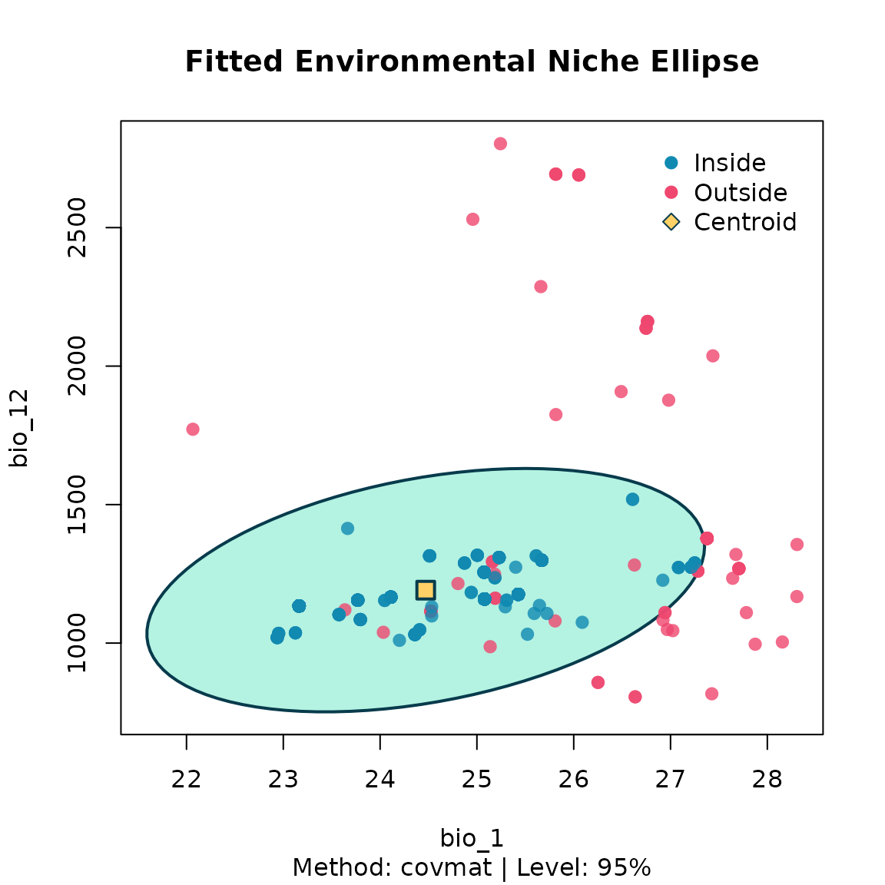
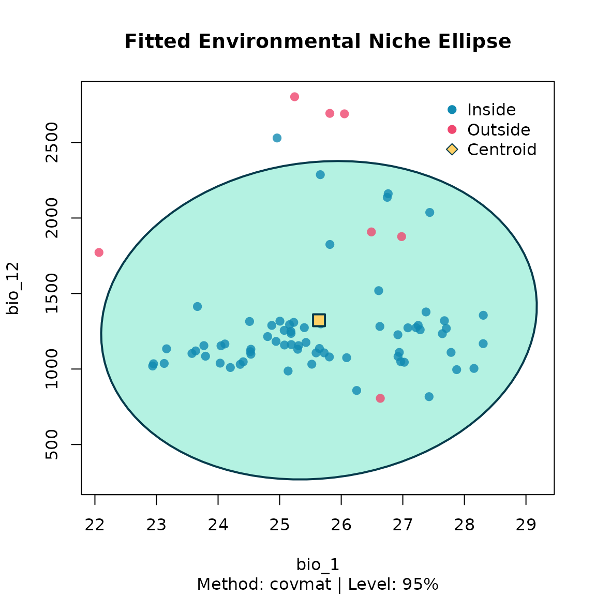
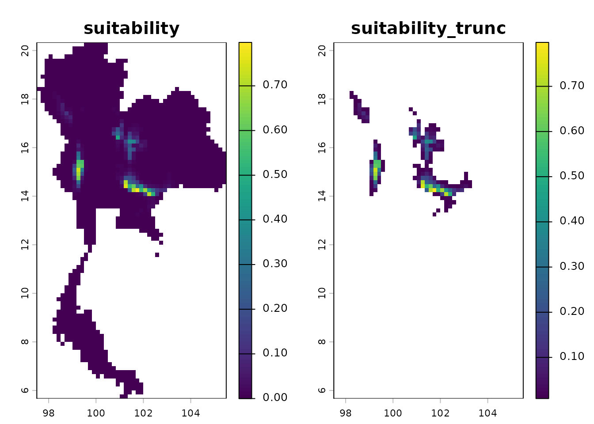

# 3. Niche modeling

After thinning, the environmental niche is summarised by a multivariate
ellipsoid via
[`fit_ellipsoid()`](https://paanwaris.github.io/bean/reference/fit_ellipsoid.md).
Two estimators are available:

- `"covmat"` — classical sample mean and covariance;
- `"mve"` — robust Minimum Volume Ellipsoid (Rousseeuw, 1985).

A 95% chi-square contour is used by default; change it with `level`.

``` r

library(bean)
data(origin_dat_prepared, package = "bean")
data(thinned_stochastic,  package = "bean")
data(thinned_deterministic, package = "bean")
env_vars <- c("bio_1", "bio_4", "bio_12", "bio_15")
```

## Fit an ellipsoid

``` r

origin_ellipse <- fit_ellipsoid(
  data     = origin_dat_prepared,
  env_vars = env_vars,
  method   = "covmat",
  level    = 0.95
)
origin_ellipse
#> -- Bean Environmental Niche Ellipsoid --
#> Method      : covmat
#> Dimensions  : 4 (bio_1, bio_4, bio_12, bio_15)
#> Level       : 95.00%
#> Points used : 1024  (inside: 947, 92.5%)
#> Centroid:
#>      bio_1      bio_4     bio_12     bio_15 
#>   24.47107  179.68260 1191.05273   76.98212
```

## Visualise (2-D)

``` r

plot(origin_ellipse, dims = c("bio_1", "bio_12"))
```



For an interactive 3-D view, install the optional package **rgl** and
call `plot(origin_ellipse, dims = c(1, 2, 3))`. If `rgl` is not
installed, the function falls back to a 2-D plot of the first two
requested variables.

## Compare thinned ellipsoids

``` r

stochastic_ellipse <- fit_ellipsoid(
  data     = thinned_stochastic$thinned_data,
  env_vars = env_vars
)
plot(stochastic_ellipse, dims = c("bio_1", "bio_12"))
```



``` r


deterministic_ellipse <- fit_ellipsoid(
  data     = thinned_deterministic$thinned_points,
  env_vars = env_vars
)
plot(deterministic_ellipse, dims = c("bio_1", "bio_12"))
```


## Predict suitability on a raster

[`predict()`](https://rspatial.github.io/terra/reference/predict.html)
returns Mahalanobis distance and a Gaussian suitability score. It works
on a `data.frame` or directly on a
[`terra::SpatRaster`](https://rspatial.github.io/terra/reference/SpatRaster-class.html).

``` r

library(terra)
#> terra 1.9.27
env <- terra::rast(system.file("extdata", "thai_env.tif", package = "bean"))

pred <- predict(
  object                 = origin_ellipse,
  newdata                = env,
  include_suitability    = TRUE,
  suitability_truncated  = TRUE,
  include_mahalanobis    = FALSE
)
plot(pred)
```


