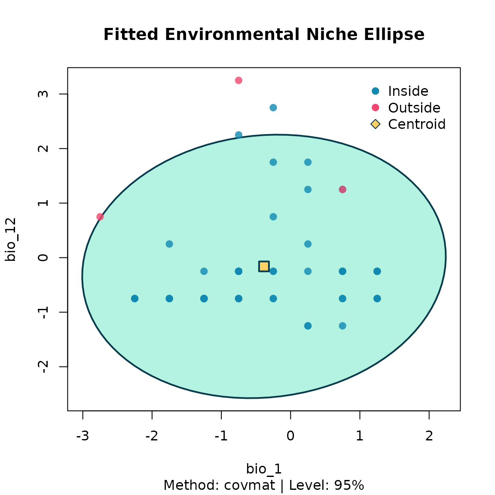

# 3. Niche modeling

After thinning, the environmental niche is summarised by a multivariate
ellipsoid via
[`fit_ellipsoid()`](https://paanwaris.github.io/bean/reference/fit_ellipsoid.md).
Two estimators are available:

- `"covmat"` — classical sample mean and covariance.
- `"mve"` — robust Minimum Volume Ellipsoid (Rousseeuw, 1985).

The ellipsoid boundary is defined by a chi-square cutoff on the squared
Mahalanobis distance, controlled by `level` (default 95 %).

``` r

library(bean)
data(origin_dat_prepared,    package = "bean")
data(thinned_stochastic,     package = "bean")
data(thinned_deterministic,  package = "bean")
env_vars <- c("bio_1", "bio_4", "bio_12", "bio_15")
```

## Fit three ellipsoids

We fit one ellipsoid to the raw prepared data and one to each of the
thinned datasets, so we can compare what bias correction does to the
inferred niche.

``` r

origin_ellipse <- fit_ellipsoid(
  data     = origin_dat_prepared,
  env_vars = env_vars,
  method   = "covmat",
  level    = 0.95
)

stochastic_ellipse <- fit_ellipsoid(
  data     = thinned_stochastic$thinned_data,
  env_vars = env_vars,
  method   = "covmat",
  level    = 0.95
)

deterministic_ellipse <- fit_ellipsoid(
  data     = thinned_deterministic$thinned_points,
  env_vars = env_vars,
  method   = "covmat",
  level    = 0.95
)

origin_ellipse
#> -- Bean Environmental Niche Ellipsoid --
#> Method      : covmat
#> Dimensions  : 4 (bio_1, bio_4, bio_12, bio_15)
#> Level       : 95.00%
#> Points used : 1024  (inside: 947, 92.5%)
#> Centroid:
#>      bio_1      bio_4     bio_12     bio_15 
#> -1.1433128 -0.1851743 -0.4804313 -0.4194209
stochastic_ellipse
#> -- Bean Environmental Niche Ellipsoid --
#> Method      : covmat
#> Dimensions  : 4 (bio_1, bio_4, bio_12, bio_15)
#> Level       : 95.00%
#> Points used : 78  (inside: 71, 91.0%)
#> Centroid:
#>      bio_1      bio_4     bio_12     bio_15 
#> -0.3502912 -0.3690432 -0.1938518 -0.4200464
deterministic_ellipse
#> -- Bean Environmental Niche Ellipsoid --
#> Method      : covmat
#> Dimensions  : 4 (bio_1, bio_4, bio_12, bio_15)
#> Level       : 95.00%
#> Points used : 56  (inside: 53, 94.6%)
#> Centroid:
#>      bio_1      bio_4     bio_12     bio_15 
#> -0.3839286 -0.4732143 -0.1607143 -0.4464286
```

## Visualise the ellipsoids (2-D slices)

``` r

plot(origin_ellipse,        dims = c("bio_1", "bio_12"))
```


``` r

plot(stochastic_ellipse,    dims = c("bio_1", "bio_12"))
```


``` r

plot(deterministic_ellipse, dims = c("bio_1", "bio_12"))
```



For an interactive 3-D view, install the optional package **rgl** and
call `plot(origin_ellipse, dims = c(1, 2, 3))`. If `rgl` is not
installed, the plot falls back to the 2-D view of the first two
requested variables.

## Inspecting the inferred niche

[`fit_ellipsoid()`](https://paanwaris.github.io/bean/reference/fit_ellipsoid.md)
returns an object that exposes the centroid, the covariance matrix, the
precomputed inverse, the variable names, and the subset of points
classified as inside or outside the ellipsoid. These are the building
blocks downstream species-distribution-modelling pipelines need.

``` r

origin_ellipse$centroid
#>      bio_1      bio_4     bio_12     bio_15 
#> -1.1433128 -0.1851743 -0.4804313 -0.4194209
origin_ellipse$cov_matrix
#>              bio_1       bio_4      bio_12      bio_15
#> bio_1   0.63868536 -0.08168806  0.11201568  0.01955072
#> bio_4  -0.08168806  0.11787467 -0.08758222  0.05482355
#> bio_12  0.11201568 -0.08758222  0.15183243 -0.06084654
#> bio_15  0.01955072  0.05482355 -0.06084654  0.07808037
origin_ellipse$dimensions
#> [1] 4
origin_ellipse$var_names
#> [1] "bio_1"  "bio_4"  "bio_12" "bio_15"
head(origin_ellipse$points_in_ellipse)
#>         species        y         x      bio_1       bio_12     bio_15
#> 1 Rusa unicolor 15.37239  99.11555 -1.6909295  0.003511156 -0.2454693
#> 2 Rusa unicolor 15.41415  99.28763 -0.8711075 -0.267821213 -0.3053829
#> 3 Rusa unicolor 14.46838 101.22005 -1.3879976 -0.534812263 -0.3835742
#> 4 Rusa unicolor 15.65606  99.31600 -0.6288324 -0.224408034 -0.2390396
#> 5 Rusa unicolor 14.39543 101.41694 -2.0311866 -0.604273349 -0.5074636
#> 7 Rusa unicolor 14.40847 101.29556 -1.3879976 -0.534812263 -0.3835742
#>        bio_4
#> 1 -0.2573387
#> 2 -0.1768698
#> 3 -0.2876102
#> 4 -0.0834852
#> 5 -0.1398570
#> 7 -0.2876102
```

## Projecting suitability with nicheR

If you intend to project a `bean_ellipsoid` into geographic space,
please install the **nicheR** package and use its
[`predict()`](https://rspatial.github.io/terra/reference/predict.html)
method. `bean_ellipsoid` objects carry `"nicheR_ellipsoid"` as a second
S3 class, so once nicheR is attached its `predict.nicheR_ellipsoid()`
method dispatches on them automatically — no conversion step is
required. If you use the prediction step in published work, please cite
nicheR (see the References section at the bottom of this vignette).

``` r

# Once nicheR is available on CRAN:
library(nicheR)
library(terra)

env <- terra::rast(system.file("extdata", "thai_env.tif", package = "bean"))

# 'origin_ellipse' is the bean_ellipsoid we fitted above.
suit <- predict(
  origin_ellipse,
  newdata               = env,
  include_suitability   = TRUE,
  suitability_truncated = TRUE,
  include_mahalanobis   = FALSE
)
terra::plot(suit)
```

Until **nicheR** is on CRAN, the same calculation can be done directly
from the fields stored in the ellipsoid:

``` r

library(terra)
env <- terra::rast(system.file("extdata", "thai_env.tif", package = "bean"))
env <- env[[origin_ellipse$var_names]]   # match variable order

D2 <- terra::app(env, function(v) {
  if (anyNA(v)) return(NA_real_)
  d <- v - origin_ellipse$centroid
  as.numeric(t(d) %*% origin_ellipse$Sigma_inv %*% d)
})
suitability <- exp(-0.5 * D2)
terra::plot(suitability)
```

## References

- Castaneda-Guzman, M., Hughes, C., Paansri, P., & Cobos, M. E. (2026).
  *nicheR: Ellipsoid-Based Virtual Niches and Visualization.* R package
  version 0.1.0. <https://github.com/castanedaM/nicheR>
- Rousseeuw, P. J. (1985). Multivariate estimation with high breakdown
  point. *Mathematical Statistics and Applications, Vol. B*, 283–297.
- Van Aelst, S. & Rousseeuw, P. (2009). Minimum volume ellipsoid. *Wiley
  Interdisciplinary Reviews: Computational Statistics*, 1(1), 71–82.
