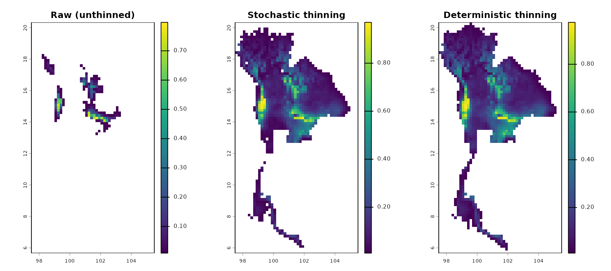

# 3. Niche modeling

After thinning, the environmental niche is summarised by a multivariate
ellipsoid via
[`fit_ellipsoid()`](https://paanwaris.github.io/bean/reference/fit_ellipsoid.md).
Two estimators are available:

- `"covmat"` — classical sample mean and covariance.
- `"mve"` — robust Minimum Volume Ellipsoid (Rousseeuw, 1985).

The ellipsoid boundary is defined by a chi-square cutoff on the squared
Mahalanobis distance, controlled by `level` (default 95 %).

``` r

library(bean)
data(origin_dat_prepared,    package = "bean")
data(thinned_stochastic,     package = "bean")
data(thinned_deterministic,  package = "bean")
env_vars <- c("bio_1", "bio_4", "bio_12", "bio_15")
```

## Fit three ellipsoids

We fit one ellipsoid to the raw prepared data and one to each of the
thinned datasets, so we can compare what bias correction does to the
inferred niche.

``` r

origin_ellipse <- fit_ellipsoid(
  data     = origin_dat_prepared,
  env_vars = env_vars,
  method   = "covmat",
  level    = 0.95
)
save(origin_ellipse, file = "origin_ellipse.rda")
stochastic_ellipse <- fit_ellipsoid(
  data     = thinned_stochastic$thinned_data,
  env_vars = env_vars,
  method   = "covmat",
  level    = 0.95
)

deterministic_ellipse <- fit_ellipsoid(
  data     = thinned_deterministic$thinned_points,
  env_vars = env_vars,
  method   = "covmat",
  level    = 0.95
)

origin_ellipse
#> -- Bean Environmental Niche Ellipsoid --
#> Method      : covmat
#> Dimensions  : 4 (bio_1, bio_4, bio_12, bio_15)
#> Level       : 95.00%
#> Points used : 1024  (inside: 947, 92.5%)
#> Centroid:
#>      bio_1      bio_4     bio_12     bio_15 
#> -1.1433128 -0.1851743 -0.4804313 -0.4194209
stochastic_ellipse
#> -- Bean Environmental Niche Ellipsoid --
#> Method      : covmat
#> Dimensions  : 4 (bio_1, bio_4, bio_12, bio_15)
#> Level       : 95.00%
#> Points used : 78  (inside: 71, 91.0%)
#> Centroid:
#>      bio_1      bio_4     bio_12     bio_15 
#> -0.3502912 -0.3690432 -0.1938518 -0.4200464
deterministic_ellipse
#> -- Bean Environmental Niche Ellipsoid --
#> Method      : covmat
#> Dimensions  : 4 (bio_1, bio_4, bio_12, bio_15)
#> Level       : 95.00%
#> Points used : 56  (inside: 53, 94.6%)
#> Centroid:
#>      bio_1      bio_4     bio_12     bio_15 
#> -0.3839286 -0.4732143 -0.1607143 -0.4464286
```

## Visualise the ellipsoids (2-D slices)

``` r

plot(origin_ellipse,        dims = c("bio_1", "bio_12"))
```


``` r

plot(stochastic_ellipse,    dims = c("bio_1", "bio_12"))
```


``` r

plot(deterministic_ellipse, dims = c("bio_1", "bio_12"))
```


For an interactive 3-D view, install the optional package **rgl** and
call `plot(origin_ellipse, dims = c(1, 2, 3))`. If `rgl` is not
installed, the plot falls back to the 2-D view of the first two
requested variables.

## Predict suitability across the landscape

[`predict()`](https://rspatial.github.io/terra/reference/predict.html)
returns Mahalanobis distance and a Gaussian suitability score
$`s = \exp(-D^2/2)`$. It accepts a `data.frame` or, more usefully, a
[`terra::SpatRaster`](https://rspatial.github.io/terra/reference/SpatRaster-class.html).
Below we project each ellipsoid back into geographic space and compare
the resulting **suitability** layers (the Mahalanobis layers behave
analogously, so we omit them here).

``` r

library(terra)
#> terra 1.9.27
env <- terra::rast(system.file("extdata", "thai_env.tif", package = "bean"))

env_scaled <- terra::scale(env)

origin_pred <- predict(
  object                = origin_ellipse,
  newdata               = env_scaled,
  include_suitability   = TRUE,
  suitability_truncated = FALSE,
  include_mahalanobis   = FALSE
)

stochastic_pred <- predict(
  object                = stochastic_ellipse,
  newdata               = env_scaled,
  include_suitability   = TRUE,
  suitability_truncated = FALSE,
  include_mahalanobis   = FALSE
)

deterministic_pred <- predict(
  object                = deterministic_ellipse,
  newdata               = env_scaled,
  include_suitability   = TRUE,
  suitability_truncated = FALSE,
  include_mahalanobis   = FALSE
)
```

### Side-by-side comparison

``` r

suit_stack <- c(origin_pred[["suitability"]],
                stochastic_pred[["suitability"]],
                deterministic_pred[["suitability"]])
names(suit_stack) <- c("Raw (unthinned)",
                       "Stochastic thinning",
                       "Deterministic thinning")

plot(suit_stack, nc = 3, mar = c(2, 2, 2.5, 4))
```


Each panel uses the same colour scale, so darker / lighter shading
across panels reflects a genuine shift in the modelled niche. Because
the raw data is biased toward heavily sampled areas, the raw model
typically over-predicts those conditions; the thinned models give a
narrower, less inflated suitability surface.

### Truncated suitability

If you prefer only the chi-square interior, set
`suitability_truncated = TRUE`:

``` r

origin_trunc <- predict(origin_ellipse,        env,
                        include_suitability = FALSE,
                        suitability_truncated = TRUE,
                        include_mahalanobis = FALSE)
stoch_trunc  <- predict(stochastic_ellipse,    env,
                        include_suitability = FALSE,
                        suitability_truncated = TRUE,
                        include_mahalanobis = FALSE)
det_trunc    <- predict(deterministic_ellipse, env,
                        include_suitability = FALSE,
                        suitability_truncated = TRUE,
                        include_mahalanobis = FALSE)

trunc_stack <- c(origin_trunc[["suitability_trunc"]],
                 stoch_trunc[["suitability_trunc"]],
                 det_trunc[["suitability_trunc"]])
names(trunc_stack) <- c("Raw (unthinned)",
                        "Stochastic thinning",
                        "Deterministic thinning")
plot(trunc_stack, nc = 3, mar = c(2, 2, 2.5, 4))
```



Values outside the chi-square contour are `NA`, leaving only the “core”
niche.

### Summarising the difference

``` r

summary_df <- data.frame(
  model        = c("Raw", "Stochastic", "Deterministic"),
  mean_suit    = sapply(list(origin_pred, stochastic_pred, deterministic_pred),
                        function(p) mean(terra::values(p[["suitability"]]), na.rm = TRUE)),
  median_suit  = sapply(list(origin_pred, stochastic_pred, deterministic_pred),
                        function(p) median(terra::values(p[["suitability"]]), na.rm = TRUE))
)
summary_df
#>           model  mean_suit  median_suit
#> 1           Raw 0.01575929 8.268550e-06
#> 2    Stochastic 0.12812961 7.113131e-02
#> 3 Deterministic 0.15473723 9.700130e-02
```

A drop in mean / median suitability after thinning is the expected
effect: bias correction makes the model less willing to call
under-sampled environments “highly suitable”.

## References

- Rousseeuw, P. J. (1985). Multivariate estimation with high breakdown
  point. *Mathematical Statistics and Applications, Vol. B*, 283–297.
- Van Aelst, S. & Rousseeuw, P. (2009). Minimum volume ellipsoid. *Wiley
  Interdisciplinary Reviews: Computational Statistics*, 1(1), 71–82.
